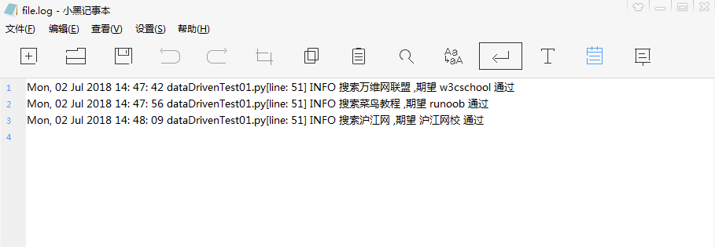

```py
#encoding = utf - 8
from selenium import webdriver
import unittest,time
import logging, traceback
import ddt
from selenium.common.exceptions import NoSuchElementException

#初始化日志对象
logging.basicConfig(
    #日志级别
    level = logging.INFO,
    #日志创建普通时间、文件名、调用日志消息的行号、日志级别名字、日志信息
    format = '%(asctime)s %(filename)s[line: %(lineno)d] %(levelname)s %(message)s',
    datefmt = '%a, %d %b %Y %H: %M: %S',
    #日志文件存放的目录以及日志文件名
    filename = r'D:\pycharm\samples_selenium\wd\lesson03\file.log',
    #打开日志文件的方式
    filemode = 'w'
)

@ddt.ddt
class TestDemo(unittest.TestCase):
    def setUp(self):
        self.driver = webdriver.Chrome(executable_path=r"D:\pycharm\chromedriver.exe")
        self.driver.implicitly_wait(10)
    #使用@ddt.data添加测试数据
    @ddt.data(["万维网联盟", "w3cschool"],["菜鸟教程", "runoob"],["沪江网" ,"沪江网校"])
    #@ddt.unpack测试方法被调用过程中，对测试数据进行解包
    @ddt.unpack
    def test_dataDrivenByObj(self, testdata, expectdata):
        url = "http://www.baidu.com"
        #访问百度
        self.driver.get(url)
        self.driver.maximize_window()
        self.driver.implicitly_wait(10)
        try:
            #输入测试数据
            self.driver.find_element_by_id("kw").send_keys(testdata)
            #点击搜索按钮
            self.driver.find_element_by_id("su").click()
            time.sleep(3)
            #断言期望结果是否出现在页面源代码中
            self.assertTrue(expectdata in self.driver.page_source,)
        except NoSuchElementException as e:
            logging.error("查找的页面元素不存在，异常堆栈信息：" + str(traceback.format_exc()))
        except AssertionError as e:
            logging.info("搜索%s,期望%s,失败" %(testdata, expectdata))
        except Exception as e:
            logging.error("未知错误，错误信息：" + str(traceback.format_exc()))
        else:
            logging.info("搜索%s ,期望 %s 通过" %(testdata, expectdata))


    def tearDown(self):
        self.driver.quit()
if __name__ == '__main__':
    unittest.main()
 ```
 
 打印结果：
 
