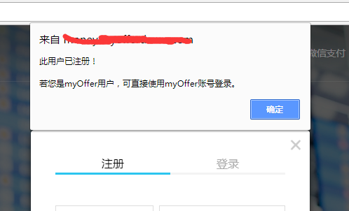

```py
from selenium import webdriver
import unittest,time
from selenium .common.exceptions import NoAlertPresentException

class PageScrollByChrome(unittest.TestCase):
    def setUp(self):
        self.driver = webdriver.Chrome()
        self.driver.implicitly_wait(10)

    def test_radioScroll(self):
        url = "https://www.myofferdemo.com/"
        self.driver.get(url)
        self.driver.maximize_window()
        #点击登录
        self.driver.find_element_by_xpath("//div[@class='li-bt-login']/a").click()
        #输入账号
        username = self.driver.find_element_by_id("login-enroll-user")
        username.send_keys("12345678912")
        time.sleep(2)
        #输入密码
        password = self.driver.find_element_by_id("login-enroll-password")
        password.send_keys("888888")
        time.sleep(2)
        #输入验证码
        verficationCode = self.driver.find_element_by_id("login-enroll-code")
        verficationCode.send_keys("888888")
        time.sleep(2)
        #点击注册
        self.driver.find_element_by_tag_name("button").click()
        time.sleep(2)
        try:
            #获取alert对象
            alert = self.driver.switch_to.alert()
            time.sleep(2)
            #使用alert.text属性获取alert框中的内容，并断言是否是alert弹窗
            self.assertEqual(alert.text, "这是一个alert弹框")
            #调用alert对象的accept()方法，模拟鼠标单击alert弹窗上的"确定"按钮
            alert.accept()
        except NoAlertPresentException as e:
            self.fail("alert弹窗未找到")
        print('e')

    def tearDown(self):
        self.driver.quit()

if __name__ == '__main__':
    unittest.main()
    
```
示例图：


