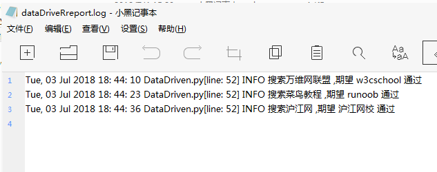

**创建一个testData.xlsx的Excel表格内容如下所示**

![excel表格}(./picture/testDataxlsx.png)

**创建一个ExcelUtil.py文件用于`编写读取Excel的脚本`内容如下所示**

```py
from openpyxl import load_workbook

class UtilExcel(object):

    def __init__(self, excelPath, sheetName):
        self.excelText = load_workbook(excelPath)#将要读取的Excel加载到内存中
        #通过工作表名称获取一个工作表对象
        self.workSheetObject = self.excelText.get_sheet_by_name(sheetName)
        self.maxRowNum = self.workSheetObject.max_row#获取工作表中的最大行号

    def getDatasFromSheet(self):
        #存放从工作表中读取出来的数据
        dataList = []
        #遍历工作表数据中的每一行，并且去除标题行
        for line in self.workSheetObject.rows[1:]:
            #将每行中各个单元格的数据取出存于列表新列表中
            newList = []
            newList.append(line[1].value)
            newList.append(line[2].value)
            #将上述存放一行数据的列表添加到最终数据列表中dataList
            dataList.append(newList)
        return dataList#将获取的所有数据的迭代对象返回

if __name__ == '__main__':
    excelPath = r'D:\UnitTest\drivers\testData.xlsx'#.xlsx文档的路径
    sheetName = "Sheet1"#.xlsx文档的工作表名
    excelData = UtilExcel(excelPath, sheetName)
    for i in excelData.getDatasFromSheet():
        print(i[0], i[1])
 ```


**创建一个DataDriven.py文件用于`编写数据驱动测试脚本代码`，内容如下所示**

```py
from selenium.common.exceptions import NoSuchElementException
from selenium import webdriver
from drivers.ExcelUtil import UtilExcel
import logging, traceback
import unittest, time, ddt

#初始化日志对象
logging.basicConfig(
    #日志级别
    level = logging.INFO,
    #日志创建普通时间、文件名、调用日志消息的行号、日志级别名字、日志信息
    format = '%(asctime)s %(filename)s[line: %(lineno)d] %(levelname)s %(message)s',
    datefmt = '%a, %d %b %Y %H: %M: %S',
    #日志文件存放的目录以及日志文件名
    filename = r'D:\UnitTest\drivers\dataDriveRreport.log',
    #打开日志文件的方式
    filemode = 'w'
)

excelPath = r'D:\UnitTest\drivers\testData.xlsx'
sheetName = "Sheet1"
#创建UtilExcel类的实例对象
excel = UtilExcel(excelPath, sheetName)

@ddt.ddt
class TestDemo(unittest.TestCase):

    def setUp(self):
        self.driver = webdriver.Chrome(executable_path=r"D:\pycharm\chromedriver.exe")
        self.driver.implicitly_wait(10)#隐式等待
    # 用getDatasFromSheet()方法接收一个可迭代的数组对象
    @ddt.data(*excel.getDatasFromSheet())
    def test_dataDrivenByExcel(self, data):
        testData, expectData = tuple(data)
        url = "http://www.baidu.com"
        self.driver.get(url)
        self.driver.maximize_window()
        print(testData, expectData)
        try:
            self.driver.find_element_by_id("kw").send_keys(testData)
            self.driver.find_element_by_id("su").click()
            time.sleep(3)
            self.assertTrue(expectData in self.driver.page_source)

        except NoSuchElementException as e:
            logging.error("查找的页面元素不存在，异常堆栈信息：" + str(traceback.format_exc()))
        except AssertionError as e:
            logging.info("搜索%s,期望%s,失败" % (testData, expectData))
        except Exception as e:
            logging.error("未知错误，错误信息：" + str(traceback.format_exc()))
        else:
            logging.info("搜索%s ,期望 %s 通过" % (testData, expectData))
    def tearDown(self):
        self.driver.quit()

if __name__ == '__main__':
    unittest.main()
 ```
 __打印的日志结果如下所示__init__
 
 
