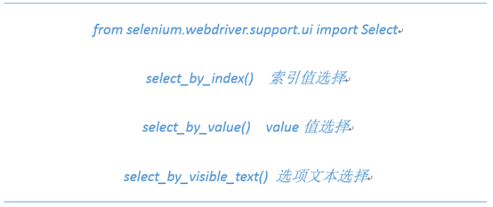

```html
<!DOCTYPE html>
<html lang="en">
<head>
    <meta charset="UTF-8">
    <title>操作prompt弹窗</title>
</head>
<body>
<select name="area" size=6 multiple="multiple">
    <option id="first" value="Beijing">北京</option>
    <option id="second" value="Shanghai">上海</option>
    <option id="third" value="Guangzhou">广州</option>
    <option id="four" value="Shenzhen">深圳</option>
    <option id="five" value="Hangzhou">杭州</option>
    <option id="six" value="Nanjing">南京</option>
</select>
</body>
</html>
```

```py
from selenium.webdriver.support.ui import Select
from selenium import webdriver
import unittest, time

class MultipleSelectionByChrome(unittest.TestCase):

    def setUp(self):
        self.driver = webdriver.Chrome()
        self.driver.implicitly_wait(10)

    def test_multipleSelectList(self):
        url = "D:\pycharm\API-Exercise\webDriverApi\prompt.html"
        #访问自定义网页
        self.driver.get(url)
        self.driver.maximize_window()
        #获取select页面元素对象
        select_element = Select(self.driver.find_element_by_xpath("//select"))
        #通过序号获取第一个元素
        select_element.select_by_index(0)
        #通过选项文本选择“上海”选项
        select_element.select_by_visible_text("上海")
        #通过选项的value属性值选择value="Guangzhou"的选项
        select_element.select_by_value("Guangzhou")
        #打印所有的选中项文本
        for option in select_element.all_selected_options:
            print(option.text)
        #取消所有已选中项
        select_element.deselect_all()
        time.sleep(2)
        #再次选中三个项
        select_element.select_by_index(3)
        select_element.select_by_visible_text("杭州")
        select_element.select_by_value("Nanjing")
        #通过选项文本取消“深圳”选项
        select_element.deselect_by_visible_text("深圳")
        #通过序号取消3的选项
        select_element.deselect_by_index(3)
        #通过value属性值取消选中的南京选项
        select_element.deselect_by_value("Nanjing")

    def tearDown(self):
        # 退出浏览器
        self.driver.quit()

if __name__ == '__main__':
    unittest.main()
```
	选择多选下拉框内容的方法：
	


	删除多选下拉框内容的方式：
	deselect_by_index()通过序号删除；
	deselect_by_value()通过value属性值删除；
	deselect_by_visible_text()通过文本删除。

