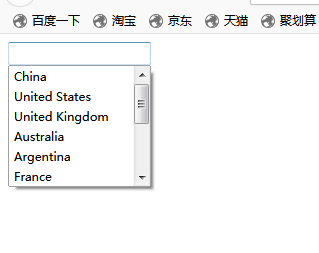

``html
<!DOCTYPE html>
<html lang="en">
<head>
    <meta charset="UTF-8">
    <title>操作可以输入的下拉列表</title>
</head>
<body>
    <div style="position:relative;">
        <input id="select" list="pasta">
        <datalist id="pasta">
            <option>China</option>
            <option>United States</option>
            <option>United Kingdom</option>
            <option>Australia</option>
            <option>Argentina</option>
            <option>France</option>
            <option>Italy</option>
            <option>India</option>
            <option>Vietnam</option>
            <option>Korea</option>
            <option>Germany</option>
        </datalist>
    </div>
</body>
</html>
```



```py
from selenium.webdriver.common.keys import Keys
from selenium import webdriver
import unittest, time

class RadioInputListByChrome(unittest.TestCase):

    def setUp(self):
        self.driver = webdriver.Chrome()
        self.driver.implicitly_wait(10)

    def test_inputList(self):
        url = "D:\pycharm\API-Exercise\webDriverApi\Selection.html"
        self.driver.get(url)
        self.driver.maximize_window()
        self.driver.find_element_by_id("select").click()
        time.sleep(2)
        #输入的同时按下箭头键
        self.driver.find_element_by_id("select").send_keys("C", Keys.ARROW_DOWN)
        self.driver.find_element_by_id("select").send_keys(Keys.ARROW_DOWN)
        self.driver.find_element_by_id("select").send_keys(Keys.ENTER)
        time.sleep(3)

    def tearDown(self):
        # 退出浏览器
        self.driver.quit()

if __name__ == '__main__':
    unittest.main()
  ```
  
	结果可以看到输入了字符"C"的同时看到筛选出的数据项中第一项被选中
