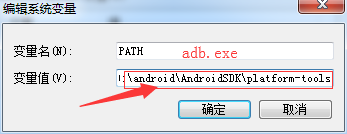
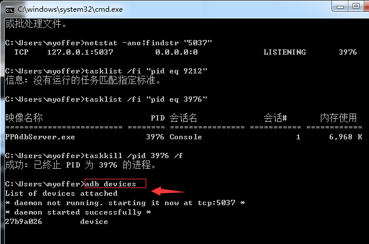

	一、使用adb devices命令了解设备的序列号和状态信息
	注意：使用adb命令的时候，最好先将adb.exe文件所在的路径放到系统的“PATH”环境变量中，否则每次输入都要先输入路径
	
	
	
	
	
	状态信息包含3种状态:
	(1)devices状态：这个状态表示设备或模拟器已经连接到adb服务器上，但这个状态并不代表手机设备或者模拟器已经启动完毕
	可以进行操作，因为Android系统在启动时会先连接到adb服务器上，但android系统启动完成后，设备或者模拟器通常是这个状态；
	
	(2)offline状态：表明设备或者模拟器没有连接到adb服务器或者没有响应；
	(3)no devices状态：这个状态表示没有物理设备或者模拟器连接。