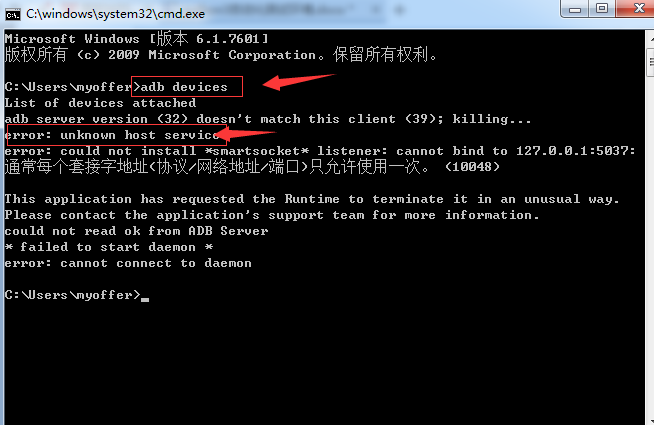

	如果使用adb devices命令报错：unknown host services
	先在命令窗口输入：netstat -ano|findstr "5037"
	查看是哪个端口占用了5037
	

	方法一：
		打开任务管理器：Ctrl+Shift+Esc
		在服务中的PID找到相关进程号并进行关闭或卸载应用

	方法二：
		使用命令：tasklist /fi “pid eq 9212”查看PID进程
		

再用命令taskkill /pid 9212 /f终止进程

