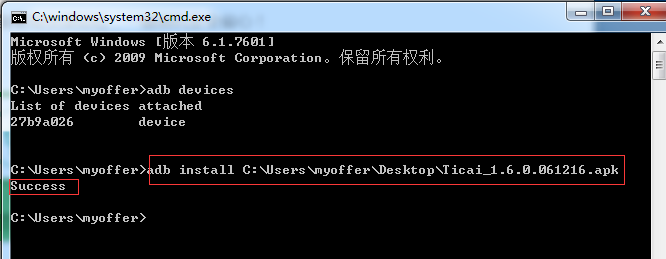
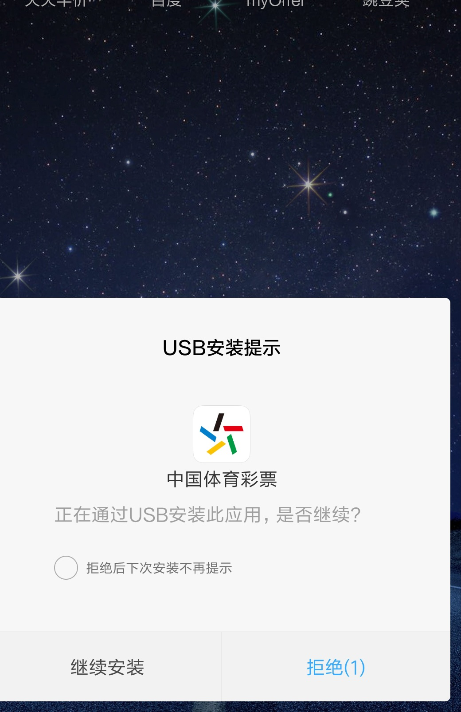
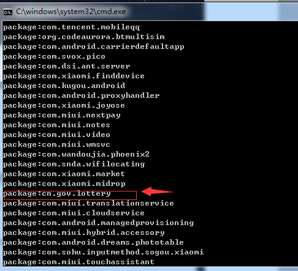
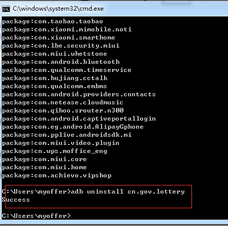

	(1)adb install指令使用：
		在cmd命令窗口中输入》 adb install +.apk包
		如下图所示：C:\Users\myoffer>adb install C:\Users\myoffer\Desktop\Ticai_1.6.0.061216.apk
		注意：.apk包一般由开发提供，操作的时候直接将apk包拖拽进入cmd窗口即可，然后在手机设备上点击“继续安装"

	如果已经安装了该应用，不想卸载，则可进行覆盖安装，只要加入“-r”参数即可：adb install -r +.apk包
	如果连接了多台设备则要指定手机设备序列号/手机模拟器序列号，需要加上"-s" 例如：adb -s27b9a026
	
	(2)adb uninstall指令使用：
		首先输入：adb shell pm list packages命令，查看设备上所有应用的包名，并找到要卸载的包名
		在cmd命令窗口中输入》 adb uninstall +你所需要卸载的应用的包名
		如下图所示：C:\Users\myoffer>adb uninstall cn.gov.lottery
		

	注意：同样的如果连接了多台设备则要指定对应的序列号，方法和安装应用一致；
	如果想保存卸载软件的配置和缓存文件，只要加入"-k"参数即可：adb uninstall -k +包名
		
		
		
		
		

		
	
	
	

