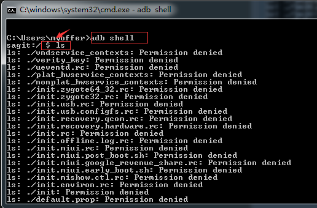
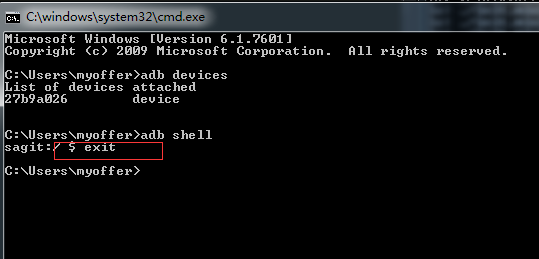
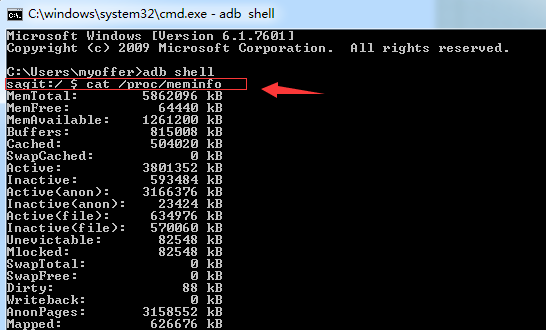
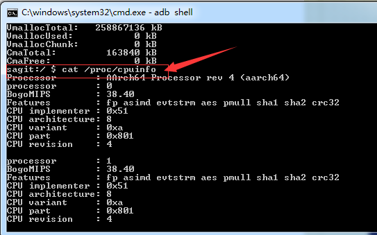

    adb shell指令：因为安卓系统是基于Linux系统开发的，支持常见的Linux命令，
    这些命令都保存在手机的“/system/bin”文件下，这里可以看到在Linux系统时
    经常操作的命令，例如："ls、cat、df、ps、kill、uptime"等。所以我们可以通过
    输入"adb shell"指令后直接加上相关的指令及其参数来执行这些指令。
    实例如下：
    
    （1）查看显示手机当前目录所有内容的指令： adb shell ls
    


    （2）退出"adb shell" 提示符，回到Windows命令行控制台指令：exit
    


    （3）查看内存信息指令：cat /proc/meminfo
    


    （4）查看cpu信息指令：cat /proc/cpuinfo
    


    （5）查看电池电量信息：adb shell dumpsys battery
    
```sh
Current Battery Service state:
  AC powered: false
  USB powered: true
  Wireless powered: false
  Max charging current: 500000
  Max charging voltage: 5000000
  Charge counter: -3842929
  status: 5
  health: 2
  present: true
  level: 100
  scale: 100
  voltage: 4340
  temperature: 300
  technology: Li-poly
```

    上述输出信息含义：
    AC powered: false--------------是否连接电源供电，false没有使用电源供电
    USB powered: true--------------是否USB供电，true是使用USB充电
    Wireless powered: false
    Max charging current: 500000
    Max charging voltage: 5000000
    Charge counter: -3842929
    status: 5----------------------电池充电状态，5表示电量是满的
    health: 2----------------------电池健康状态，2表示状态良好
    present: true------------------手机上是否有电池，true表示有电池
    level: 100---------------------当前剩余电量，100满电状态
    scale: 100---------------------电池电量最大值，通常是100
    voltage: 4340------------------电池电压（mv）
    temperature: 300---------------当前电池温度，300表示3.00度
    technology: Li-poly------------电池使用的技术
    
    （6）查看无线网络信息：adb shell dumpsys wifi
    注意：因为wifi信息一般内容都很多后面加入“|more"参数这样信息显示满一页后就暂停输出
    
```sh
Wi-Fi is enabled
Stay-awake conditions: 0
mInIdleMode false
mScanPending false
WifiController:
 total records=15589
 rec[0]: time=07-18 16:49:38.534 processed=DefaultState org=DeviceActiveState de
st=<null> what=155652(0x26004)
 rec[1]: time=07-18 16:50:22.182 processed=DefaultState org=DeviceActiveState de
st=<null> what=155652(0x26004)
 rec[2]: time=07-18 16:50:23.557 processed=DefaultState org=DeviceActiveState de
st=<null> what=155652(0x26004)
 rec[3]: time=07-18 16:50:30.957 processed=DefaultState org=DeviceActiveState de
st=<null> what=155652(0x26004)
 rec[4]: time=07-18 16:50:45.264 processed=DefaultState org=DeviceActiveState de
st=<null> what=155652(0x26004)
 rec[5]: time=07-18 16:50:46.083 processed=DefaultState org=DeviceActiveState de
st=<null> what=155652(0x26004)
 rec[6]: time=07-18 16:51:22.452 processed=DefaultState org=DeviceActiveState de
st=<null> what=155652(0x26004)
 rec[7]: time=07-18 16:52:12.962 processed=DefaultState org=DeviceActiveState de
st=<null> what=155652(0x26004)
 rec[8]: time=07-18 16:52:22.451 processed=DefaultState org=DeviceActiveState de
st=<null> what=155652(0x26004)
-- More  --
```

    Wi-Fi is enadled 表示wifi连接状态（有五种状态）
    （1）WIFI_STATE_DISABLED(WiFi已关闭）
    （2）WIFI_STATE_DISABLING(WiFi正在关闭）
    （3）WIFI_STATE_ENABLED(WiFi已启动）
    （4）WIFI_STATE_ENABLING(WiFi已关闭）
    （5）WIFI_STATE_DISABLED(WiFi已关闭）
    
    （7）查看电源管理的相关信息指令：adb shell dumpsys power
        
```sh
C:\Users\myoffer>adb shell dumpsys power | findstr "mScreenOffTimeoutSetting"
  mScreenOffTimeoutSetting=300000
```

    因为只输入adb shell dumpsys power命令会输出很多信息，所以我们通过加入查找条件找到特定信息
    上面的“mScreenOffTimeoutSetting”就是屏幕的关闭时间300000就是五分钟。
    注意：在Windows系统可以加入"findstr"或者"grep"，在Linux系统只能加入"grep"
    
    需要了解这些信息是因为在进行移动测试自动化测试的时候，有时需要判断手机是否处于锁屏状态，
    以及根据手机的一些设置来决定操作，比如手机设置的是5分钟手机就关闭屏幕，我们在进行自动化
    脚本设计的时候，在长时间停顿后就要判断是否超过了锁屏时间，从而采取不同操作，如果没超过则
    进行输入操作，超过了就需要激活屏幕，锁屏了还要进行先解锁再操作。
    
    （8）查看电话相关信息的指令：adb shell dumpsys telephony.registry
    
    （9）查看I/O内存分区相关信息指令：adb shell cat /proc/iomem
    
    （10）获取手机型号指令：adb shell cat /system/build.prop | findstr "ro.product.model"
    
    （11）获取手机处理器信息指令：adb shell cat /proc/cpuinfo | findstr "Processor"
    
    （12）获取手机内存信息指令：adb shell cat /proc/meminfo | findstr "MemTotal"
    
```sh
C:\Users\myoffer>adb shell cat /proc/meminfo | findstr "MemTotal"
MemTotal:        2847244 kB
```

    （13）获取手机系统版本信息指令：adb shell getprop ro.build.version.release
    
 ```sh
 C:\Users\myoffer>adb shell getprop ro.build.version.release
 8.0.0
 ```
    

    （14）获取手机内核版本信息指令：adb shell cat /proc/version
    
  ```sh
  C:\Users\myoffer>adb shell cat /proc/version
  Linux version 4.4.23+ (android@localhost) (gcc version 4.9.x 20150123 (prereleas
  e) (GCC) ) #1 SMP PREEMPT Sat May 5 04:10:32 CST 2018
  ```
  
    （15）获取Android系统各个分区相关信息指令：adb shell df
    
  ```sh
  C:\Users\myoffer>adb shell df
Filesystem            1K-blocks    Used Available Use% Mounted on
rootfs                  1367164   18280   1348884   2% /
tmpfs                   1399044     656   1398388   1% /dev
/dev/block/mmcblk0p51   3014596 2064504    933708  69% /system
/dev/block/mmcblk0p54    765280  534512    214968  72% /vendor
/dev/block/mmcblk0p43    122796   99896     20324  84% /odm
/dev/block/mmcblk0p53     27552    8840     18072  33% /version
/dev/block/mmcblk0p55    186268  104864     77536  58% /product
/dev/block/mmcblk0p52    186268  128548     53852  71% /cust
tmpfs                   1399044       0   1399044   0% /mnt
none                    1399044       0   1399044   0% /sys/fs/cgroup
/dev/block/mmcblk0p56  24619008 6364648  16939544  28% /data
/dev/block/mmcblk0p42    124912     104    122188   1% /cache
/data/media            24598528 7679464  16919064  32% /storage/emulated
  ```

    (16)adb shell dmesg指令输出Linux内核的环形缓冲区信息
    权限不足操作步骤如下：其中dmesg > /sdcard/log.txt表示将信息放到SD卡的log.txt文件中
    
```sh
C:\Users\myoffer>adb shell
HWPRA-H:/ $ su root
HWPRA-H:/ # dmesg > /sdcard/log.txt
HWPRA-H:/ #
```
      
  
  


    
    
    
    
    