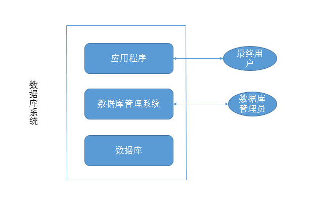
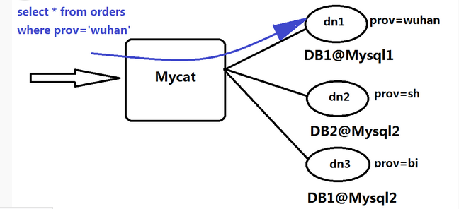

http://code.taobao.org/

http://tengine.taobao.org/

1、数据库相关概念

    大多数数据库都是非结构化的(格式不固定的)
    
数据
    
    * 描述事物的符号
    * 多种表现形式：文本、图形、音频、视频
    
数据库(Datebase DB)

    * 存放数据的仓库，存放在计算机中，按照一定的格式存放，可为用户共享
    
数据库管理系统(Database Management System , DBMS)

    * 如何科学的组织和存储数据，如何高效的获取和维护数据，靠数据库管理统一完成。
    * Oracle  MySQL  SQL Server  DB2 FoxPro, Acess
    
 数据库应用程序(DBAS)
 
    * 在数据库管理系统基础上，使用数据库管理系统的语法，开发的直接面对最终用户的应用程序
    * 学生管理系统、人事管理系统、图书管理系统
    
数据库管理员(Database Administrator , DBA)

    * 数据库管理系统的操作者
    
最终用户

    * 数据库应用程序的使用者
    
数据库系统(Database System , DBS)

    * 数据库+数据库管理系统+数据库应用程序+数据库管理员+最终用户
    

2、关系型数据库(基于磁盘的，所以读写速度不是很快)

    为了提高用户体验，尽可能的不要频繁的读写关系型数据库，所以
    就在关系型数据库上面，再建立一层关系型数据库，将常用的数据
    都放在里面，专门用来缓存数据(基于内存)的使用，除非数据更新
    才要访问关系型数据库
    
    * 采用关系（二维表）结构储存与管理数据
    * 采用结构化查询语言(SQL)，作为客户端程序数据库服务器间沟通的桥梁
    * 目前主流的数据库技术
    
3、NOSQL数据库

    * Not Only SQL数据库，泛指非关系型数据库，如MongDB
    
    * 关系数据库在超大规模和高并发的web2.0纯动态网站，暴露了很多难以
    克服的困难,NoSQL数据库就是为了解决大规模数据集合多重数据种类带来
    的挑战，尤其是大数据应用难题。

学习MyCat:代替昂贵的Oracle的MySQL集群中间插件

    多个MySQL和mycat组成集群，因为主从复制的原因，即使其中一台mysql挂了，
    另一台也可以继续使用，可以保证数据库不宕机
    
 
