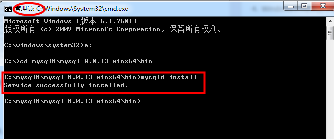
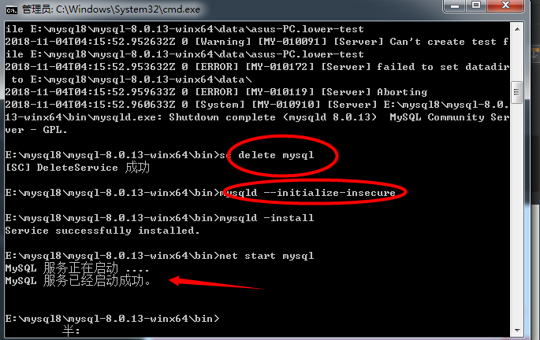
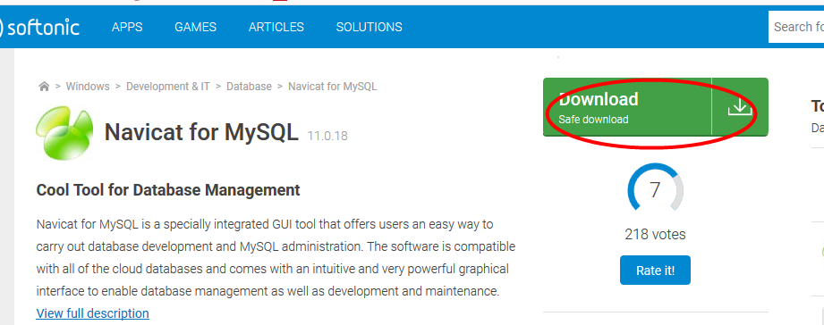

http://code.taobao.org/ 阿里开源网站
http://tengine.taobao.org/

1、windows下安装mysql

    （1）下载网址：https://dev.mysql.com/downloads/mysql/
    拉倒最下面，看清楚了64bit ZIP Archive ，点击Download。
    

    （2）登录（login），或者 申请账号（sign up）个就行了，登录或者申请成功后就会开始下载。
        （记住密码要字母和数字组合，字母要有大写）
        

    (3)注册登录成功后，点击DownNow

    (4)下载成功后解压到指定文件夹即可
    

    (5)配置默认文件
    
    其实理论上现在这样就可以直接安装服务了，但是因为是默认配置，我们使用的时候会出现很多问题。
    比如里面的汉字全是乱码之类的，所以建议你先配置一下默认文件
    
    打开刚刚解压的文件夹E:\mysql8\mysql-8.0.13-winx64 ，发现里面有my-default.ini配置文件，这个是默
    认的配置文件，复制一个自己的改名字为my.ini，并修改安装目录和保存数据的目录

编辑my.ini配置以下基本信息：

    (6)安装mysql，启动服务
    
        * 在bin目录下使用管理员身份，选择打开cmd命令窗口
        
        * 输入mysqld install回车运行，出现安装成功就可以了。(注意是mysqld，不是mysql)
        

    * 接着就是在输入 net start mysql 启动服务。或者不嫌麻烦就手动，打开服务手动启动了mysql服务了
    发现服务无法启动
    

解决方案：

    1.删除自己手动创建的data文件夹；

    2.管理员权限CMD的bin目录下，移除已错误安装的mysqld服务；
    
    D:\mysql-8.0.11-winx64\bin>mysqld -remove MySQL
    The service doesn't exist!
    
    3.在CMD的bin目录下执行mysqld --initialize-insecure
    
    会发现程序在mysql的根目录下自动创建了data文件夹以及相关的文件
    
    4.bin目录下执行mysqld -install
    
    Service successfully installed.
    
    5.bin目录下执行mysql服务启动net start mysql
    MySQL 服务正在启动 ..
    MySQL 服务已经启动成功。
    
 
 
    (7)打开mysql
        1. cmd到bin目录下执行mysql -uroot （无需密码） 
        2. 给用户设置一个密码：mysqladmin -u root -p password 
        设置密码时发现报错：Access denied for user 'root'@'localhost' (using password: YES)
        是因为未给localhost root用户授权，这里新建一个用户，然后授权给他
 
 

    (8)设置或修改root用户密码
    默认root密码为空的话 ，下面使用navicat就无法连接，所以我们需要修改root的密码。

    这是很关键的一步。此处踩过N多坑，后来查阅很多才知道在mysql 5.7.9以后废弃了password字段和password()函数；
    authentication_string:字段表示用户密码。
    --------------------- 
    
    设置步骤1；无密码账号登录进去： mysql -uroot -p 要求输入密码不用管直接回车
        步骤2：use mysql;  不要忘记加分号
        步骤3：ALTER USER 'root'@'localhost' IDENTIFIED WITH mysql_native_password BY '你的密码';  
               注意密码要：大小写字母以及数字和特殊字符组成
        步骤4：FLUSH PRIVILEGES;
    
  
 
    (9)虽然打开mysql 了，但每次打开mysql 都要输入那么多指令切换目录是不是
    
    右键我的电脑->属性->高级系统设置->环境变量->path->编辑，将你的mysql软件下的bin目录的全路径放里面。
    我建议童鞋们放在最前面，最后在那个目录的路径后面加个英文的分号（;）保存就行了。如D:\mysql\mysql-x.x.xx-winx64\bin;
 
    ？简单的说环境变量里面的path路径这东西，就是cmd系统的查找目录路径。你输入一个指令，系统怎么知道这个指令有没有呢？
    系统做了什么事？其实系统是在当前目录和系统环境变量path里面的路径全部查找一边，找到第一个为准，找不到就报错。所以
    我们要不每次都切换cmd目录，要不就设置了，以后就不需要再切换cmd路径了。
    
    注意:net stop mysql 为关闭服务，exit 退出mysql数据库
    
   

2、linux系统下安装mysql

    yum源配置好后
    (1)输入命令安装：yum -y install mysql-server (不可写成mysql，这样表示安装客户端)  
    
    (2)cd /etc/init.d/就可以查看所有的服务启动脚本其中就有mysqld
        输入命令启动服务：service mysqld start
        
      随机启动的命令(即操作系统启动，mysql也启动)：chkconfig mysql on
      可以使用chkconfig --list查看哪些服务可以随机启动的 
      
      只要是网络服务都绑定了一个网络接口并且一定监听了一个地址用一下命令就可以查看端口
      和网络接口(ip地址) 0.0.0.0:3306  
      netstat -ntpl | grep mysql
      
      输出结果为： 0.0.0.0:3306  其中0.0.0.0表示任意网络ip地址
      
3、mysql客户端(navicat)安装

    步骤1.进https://navicatformysql.en.softonic.com/官网
    
 

    步骤2：点击下图的按钮下载
    
     

    步骤3：下载成功后并安装即可
    步骤4：安装成功后打开下面界面
    
     

    步骤5：输入框输入对应内容即可连接成功
    
    步骤6：破解次软件在网盘下载：
    链接：https://pan.baidu.com/s/1CjV7JVzi7pVqlxKMQ3S8wg 
    密码：hk59
    
    解压后如下所示
    
   

    具体步骤如下：安装navicat for mysql 软件后，
    将PatchNavicat.exe拷到navicat for mysql 软件的安装目录，执行OK！
    

    命令：show database;  显示数据库
    进入数据库： use mysql; 
    查看版本：select version();
    查看所有的表： show tables;
    登录mysql：mysql -u root -p
    查看时间：select now();
    
注意：不要删除数据库自带的mysql，只可查看，不可修改，删除
       每个语句结束后，要使用分号
       
远程连接

    一般在公司开发中，可能会将数据库统一搭建在一台服务器上，所有开发人员
    共用一个数据库，而不是在自己的电脑中配置一个数据库
    
    运行命令
    mysql -hip地址 -uroot -p
    
        * -h 后面写要连接的主机ip地址
        * -u 后面写要连接的用户名
        * -p 回车后输入密码
        

