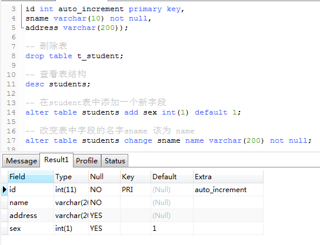
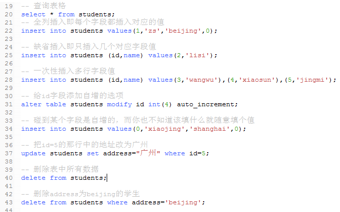

DDL语句的操作

1、数据操作(DML、DQL)

    * 修改
    update 表名 set 列1=值1,... where条件

注意：一定要加where条件，否则默认全部删除
    
    * 删除
    delete 表名 where条件
    
   

2、备份与数据恢复

    数据备份
    
        在cmd命令窗口中，不要进入mysql，只需要进入到bin目录下执行
        mysqldump -root -p students > d:/db_test.sql (students为数据库名)
        意思是：将students数据库导入到d盘中并命名一个db_test.sql的文件中
        
    数据恢复
    
        比如将上述备份的数据导出来用，需执行命令
        mysql -uroot -p 数据库名 < d:/db_test.sql
        
注意：navicat的图形界面要修改表，找到对应表右键选择--设计表--修改后保存
   