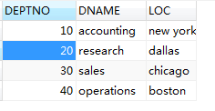
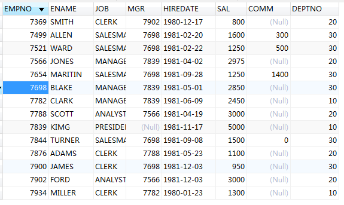
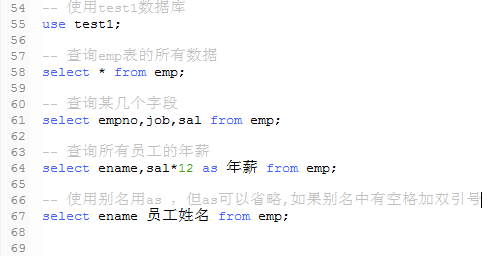
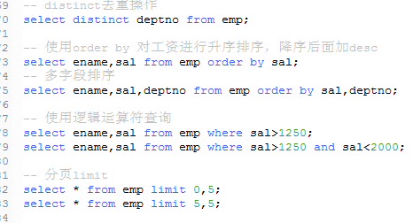

select

    建立emp员工表、dept部门表
    (1)、拷贝了表的信息到电脑中，然后登陆到mysql中，先创建一个数据库
    或者使用现有的数据库；
    
    (2)、进入数据库
    mysql> use test;
    Database Changed
    mysql> show tables;
    Empty set(0.01 sec)
    
    #suorce 加文件路径
    mysql> source d:\test\student.sql
    

简单查询和使用别名

    mysql不支持：连接运算符使用“||”
    
    * 使用distinct关键字清除重复行，它的作用范围是后面所有字段的组合
    
    * 使用order by子句对查询结果进行排序，默认是升序，降序加入desc
    
    * 使用逻辑运算符查询：where 、and 、or  使用小括号可以强行改变运算顺序
        is null 或者is not null查询是否为空
        优先级：算术>连接>比较>逻辑(and or not)
        
    * 分页显示关键字：limit 第一个参数表示从第几行开始取，第二个参数表示取几行
        返回的结果是存放在内存中的，所以使用分页可以防止内存溢出 ，数据库崩溃
        
   

sql语句的执行顺序

    select ename,sal from emp where sal>1250 and sal<2000 order by sal;
    
    先执行： from emp  ----这样才知道查哪张表
    然后执行where； where sal>1250 and sal<2000
    (先筛选再执行select,这样取的字段更少，不用一次性字段所有的信息都取出来)
    再执行： select ename,sal
    最后执行： order by sal  
    