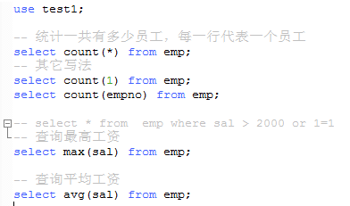
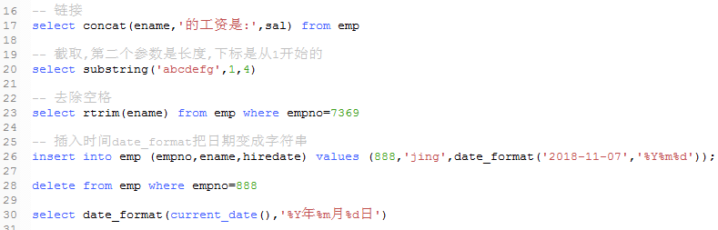
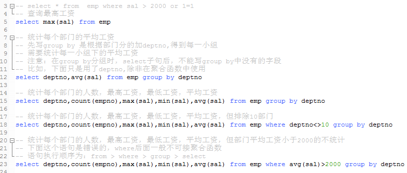
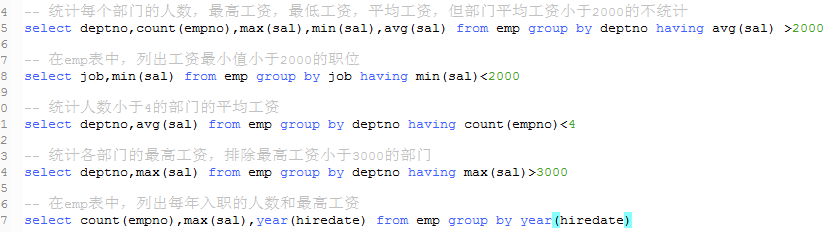

1、聚合函数

    * 为了快速的得到统计数据，提供5个聚合函数
    
    a  max(列)表示求次列最大值
    b  min(列)表示求次列最小值
    c  sum(列)表示求次列的和
    d  avg(列)表示求次列的平均值
    e  count(*)表示计算总行数，括号中写*与列名，结果是相同的
    

2、内置函数

    字符串函数
    
    数字函数
    
    日期时间函数
    

3、分组查询

    group by 子句将表中数据分成若干小组(写在where后面,没有where,就直接在from后面)
    语法格式：(order by 不可以写在group by ,where前面)
    select deptno,avg(sal),ename
    from emp
    where empno=888
    group by deptno
    orderby ename
    

4、having过滤

    * 对分组查询的结果进行过滤，要使用having从句
    * having从句过滤分组后的结果，它只能出现在group by之后，而where从句在group by之前
    * where过滤行，having过滤分组，having支持所有的where操作符(> = < and or....)
    
    执行顺序：from--where--group by--having--select--orderby    
    
