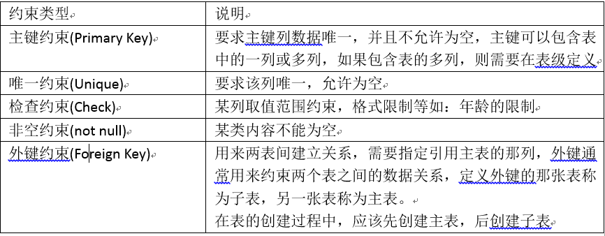

表的约束:限定字段的值

    * 主键约束 = 唯一约束+非空约束
    * 一个表中只允许一个主键
    * 一个表可能由两个或两个以上的字段组成主键
    * id number(4) primarykey;
    

上面表格中满足empno、ename、job相同才成为一个主键(这就是多字段组成主键也叫联合主键)

    * 一般不使用联合主键
    
    非空约束：确保字段值不允许为空，只能在字段级定义
    * name varchar(20) not null 
    
    检查约束：比如default，check
    * age number(2) check(age>0 and age<100)这是范围检查约束
    
    唯一约束
    * name varchar(25) not null unique
    
    外键约束：必有当前列的内容和另外一张表格中的某些内容相同，才能关联
    * froeign key (deptno) references dept(deptno)
    
    添加约束
    * alter table 表名
      add constraint 约束名 约束类型 具体约束说明
      
    删除约束
    * alter table 表名
      drop constraint 约束名

    

      
    -- 添加外键时名字可以随意书写，fk_deptno,foreign key后面接外键名，references后面接参考表中的主键
    alter table t_dept add constraint `fk_deptno11` foreign key (`parent_id`) references `t_dept`(`id`)