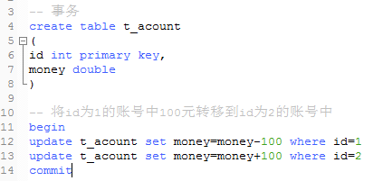

事务(Tramsaction)

    * 是一个操作序列，这些操作要么都做，要么都不做，是一个不可分割的工作单位，
      是数据库环境中的逻辑工作单位
      
      -- 当一个业务逻辑需要多条sql语句完成时，如果其中某条sql语句出错，则希望整个操作都回退。
      -- 使用事务可以完成退回的功能，保证业务逻辑的正确性。
    
    * 事务是为了保证数据库的完整性
    
    * 事务语句
      
      --开启 begin
      --提交 commit(数据在commit之前都是不变的，只是记录了)
      --回滚 rollback(如果执行事务的某条语句出错，输入rollback回滚即可)
      
尽可能减少使用事务的频率，因为事务的本质就是加上了锁，要改变数据才考虑使用事务

    事务结束后的结果
    
     
      
