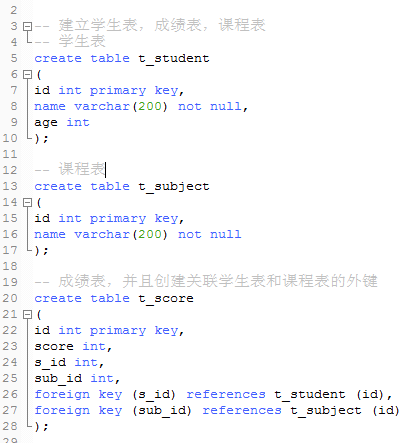
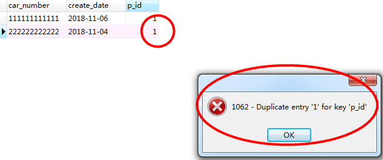
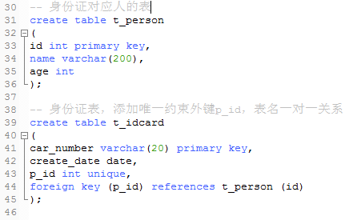
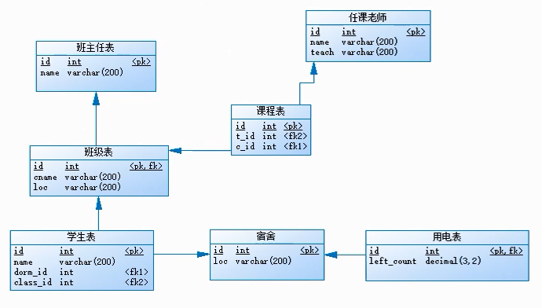

表的关系： 因为无法在一张表中记录所有的数据，所以就有了表与表之间的关系

    * 一对一 >>>>比如身份证信息与一个人
    * 一对多 >>>>部门与员工：一个部门中有多个员工；省份和城市的关系
    * 多对多 >>>>学生和科目：一个学生可以选择多门科目，一个科目也可以被多个学生选择
    
    关系型数据库是无法表达多对多的关系的，一般使用第三张表拆成两个多对一的关系
    
        -- 就像上图中的，如果只考虑学生和科目表，成绩表作为第三张表，
        -- 学生和成绩之间是一对多，科目和成绩也是一对多，反过来就是多对一
        
 

    * 一对一表示方法，需要在外键加上唯一约束，unique
    * 外键字段可以在这任意的一张表中

    上图p_id相同违反了唯一约束unique
     
     

总结

    一对多的关联关系，只需要在多的那张表中增加一个外键字段
    比如部门和员工表中：员工作为多的一方，就需要增加外键约束
    
    多对多 关联关系，需要找到一个中间表转化成两个多对一的关系
    
可以根据需求马上构造出各种表

    例如：大学环境--班主任，任课老师，班级，学生，宿舍，电表
    假如建立一个学校系统则需要根据上述信息建立起表信息
    
    可以使用powerDesign辅助建表
    
    * 班主任表包含的字段：id、name 
    * 任课老师表包含的字段：id、name、teach(教学的科目)
    * 班级表包含的字段：id、cname(班级名字)、loc(教室地址)
    * 学生表包含的字段：id、name
    * 宿舍表包含的字段：id、loc
    * 电表包含的字段：count(电量)
    
分析各个表之间的关系

    --- 首先班级表和班主任表是一对一关系，所以可以在任意一张表中添加外键约束，
        并且保证这个字段存在唯一约束；故在班级表先添加一个外键t_id并添加unique，
        或者直接主键作为外键
        
    --- 然后任课老师表和班级之间是多对多的关系，所以需要建立一个中间表t_subject
        (课程表)包含字段(t_id)外键来关联任课老师表，还创建对应每个班级的外键字段(c_id)
        
    --- 接着宿舍表和学生表是一对多关系，因为学生为多，所以在学生表中添加外键的字段(dom_id)
    
    --- 之后班级表和学生表也存在一对多关系，因为学生为多，所以又在学生表添加一个外键字段(class_id)
    
    --- 现在确定用电表和宿舍表是一对一关系，所以可以把主键作为外键进行关联
    

上图的箭头为多指向一的方向

    注意约束最好用constraint起个名字，方便删除 