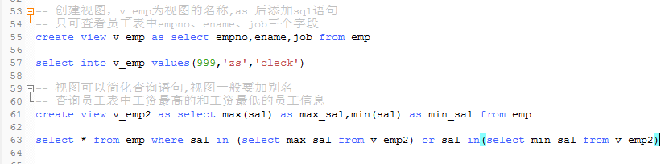

1、索引
    
    问题：当数据库表中存在很多记录，比如大于10万条时，查询速度便是一个问题
    
    分析：在书中查询某内容时，首先在目录中查询所需的知识点，然后根据目录中
    提供的页面进行查询内容，可以极大的缩短查询时间
    
    解决：可以建立类似目录的数据库对象，实现数据快速查询，这就是索引 
  
索引的作用：

    在数据库中用来加速对表的查询，通过使用快速路径访问方法快速定位数据，减少了磁盘I/O
    
    索引创建以后，在用户撤销它之前并不会用到该索引的名字，但索引在用户查询时，会自动起作用
    
索引的缺点：

    索引仅仅可以增加查询的速度，但会降低增、删、改的效率
    
索引的创建有两种情况：

    * 自动---当在表中定义一个primary key或者unique约束条件时，
      索引会自动添加一个对应的唯一索引；
      
    * 手动---用户可以创建索引以加速查询
    

开发中使用索引的要点：

    ---1.索引数据可能要占用大量的存储空间；
    ---2.索引改善了检索操作性能，但降低了数据插入、修改、删除的性能，
         在执行这些操作的时候，DBMS必须动态的更新索引；
    ---3.限制表中索引的数目，索引越多，在修改表时对索引做出修改的工作量越大；   
    
    ---4.并非所有数据都适合索引，唯一性不好的数据从索引得到的好处较小；
    ---5.索引用于数据过滤和数据排序，如果经常以某种特定顺序排序数据，则可使用索引；
    ---6.可以在索引中定义多个列(如省加城市)，这样的索引只在省加城市
         的时候起作用。 
         
2、视图(View)：只是虚表，不是真正的表，但跟表有相同的特点

    作用：  对本来已经存在的表构造出的一个虚表；
          * 可以限制对数据的访问，可以给用户授予部分的访问权限而不是整个表的权限  
          
    假如员工表不想给他人查看工资，就可建立一张视图，只告诉别人视图的名字

创建视图

    如果创建的视图只可以查询，只需要在创建视图后假如with read only
    删除视图：drop view 视图名
    
    ---1. 使用视图可以提高数据访问的安全性，只显示指定的行列数据
    ---2. 使用视图可以降低查询的难度，定制数据查询
    ---3. 可以对视图进行CRUD操作，实际上是对基本表的操作
    ---4、如果视图对应多个表，一般不允许添加操作，可以通过触发器解决
    
