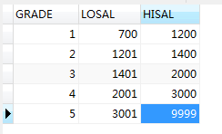
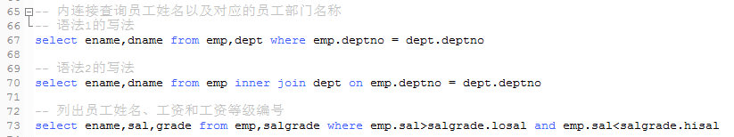
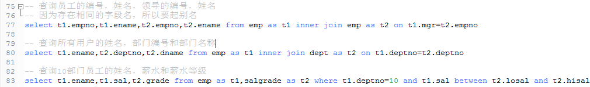
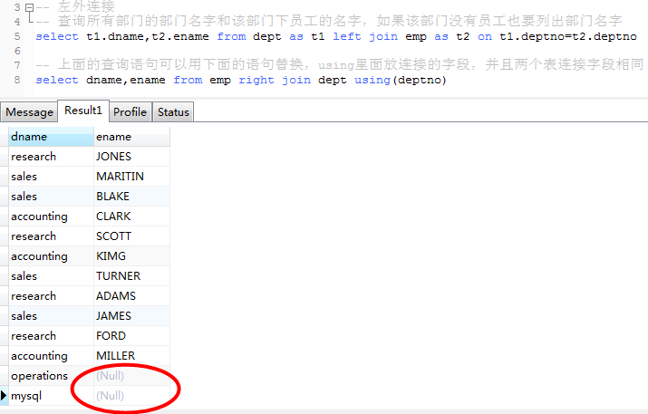
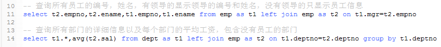

1、内连接：具有两种语法规则，并不是替代关系

    语法一：
    select 
    from 表名1,表名2
    where 表名1.deptno = 表名2.deptno 表连接的条件(如外键约束)
    
    语法二：
    select
    from 表名1 inner join 表名2 on 表名1.deptno = 表名2.deptno
    
    其中inner可以省略
 
注意：不通过外键约束连接的表，一般使用第一种语法

    部门之间存在自关联
    

    总结：关联几张表进行查询的时候，最好使用别名，单张表的自关联一定要使用别名
    
2、外连接

    ---1.左外连接 在join 前加left outer 其中outer可以省略
        两个表在连接过程中除返回满足连接条件的行以外，还返回
        左表中不满足条件的所有行；
        
    ---2.右外连接 在join 前加right
        两个表在连接过程中除返回满足连接条件的行以外，还返回
        右表中不满足条件的所有行；
        
    ---3.全外连接 在join 前加full
        两个表在连接过程中除返回满足连接条件的行以外，还返回
        两个表中不满足条件的所有行；
   

       

   