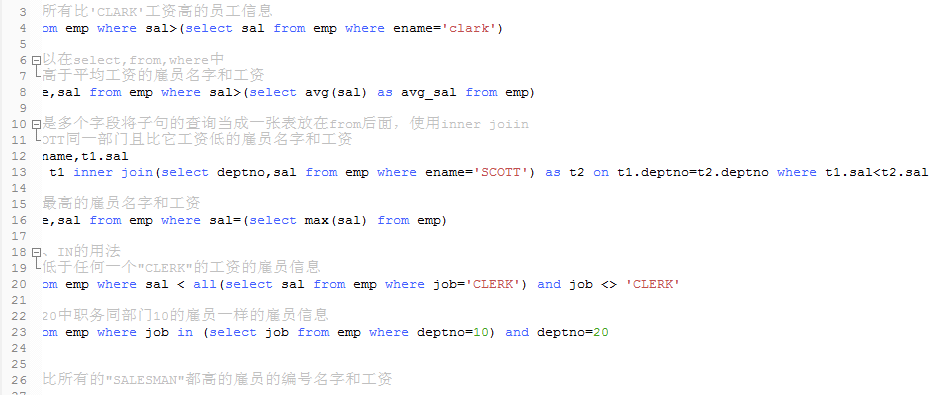
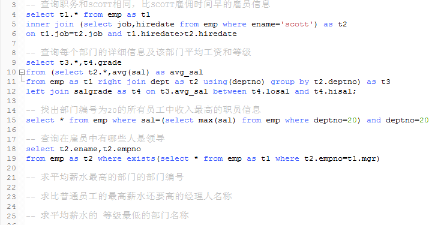

子查询

    语法格式
    select 字段列表 from table
    where 表达式 operator (select 字段列表 from table)
    
重点：子查询语句

    >>>>一般先考虑括号中的子句内容，
    >>>>然后考虑子句中返回的是几行几列，是单行单列还是多行多列...
    
单行子查询：

    如果是返回单行单列才可以使用">","<","=","<>"这样的判断，
    不可能拿一列和一个集合进行判断
多行子查询：

    如果返回是多行多列就将其当成一张表写在from后面，并且用inner join连接
    
    * 多行子查询返回多行记录
    * 对多行子查询只能使用多行记录比较运算符
    ---ALL 和子查询所有值进行比较
    ---ANY 和子查询返回的任意一个值进行比较
    ---IN 等于列表中的任何一个
    
    特点：
        1.子查询在主查询前执行一次
        2.主查询使用子查询的结果

问题引入：
    

练习：

    https://blog.csdn.net/CSDN_GIA/article/details/72356950
    