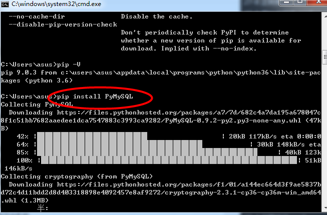

python访问mysql数据库：使用TCP连接

    ----------------------------
    无论使用哪种数据库，用户写的python程序几乎一致，只是使用不同的模块
    
1、安装引入模块

    * pip3 install PyMySQL
    
    * 在windows系统中先找到pip
    


2、写入python程序

    ------------------先了解下面的几个对象
    
Connection对象

    * 用于创建与数据库的连接
    * 创建对象，调用connect()方法
    ------参数列表如下：
    ---1.参数host: 连接mysql主机，如果主机是'localhost'
    ---2.参数port: 连接mysql主机的端口，默认是3306
    ---3.参数db: 数据库的名称
    ---4.参数user: 连接的用户名
    ---5.参数password: 连接的密码
    ---6.参数charset: 通信采用的编码方式，默认是gb2312,要求与数据创建时指定的编码一致，否则会乱码
    
    * 对象的方法
    ---1.close() 关闭连接
    ---2.commit() 事务：需要提交才生效
    ---3.rollback() 事务；放弃之前的操作
    ---4.cursor() 返回cursor对象，用于执行sql语句并获取结果
 
Cursor游标对象跟oracle的cursor无关

    * 执行sql语句
    * 创建对象，调用Connect对象的connect()方法
    
    对象的方法
    --- close() 关闭
    --- execute(operation [,paramefers]) 执行语句，返回受影响的行数  
    --- fetchone() 执行查询语句时，获取查询结果集的第一行数据，返回一个元组
    --- next() 执行查询语句时，获取当前行的下一行
    --- fetchall() 执行查询时，获取结果集的所有行，一行构成一个元组，
                   再将这个元组装入一个元组返回  
                   
http://www.runoob.com/python/python-mysql.html

```python
import pymysql

#创建数据库连接,要连接多个就再复制
connection = pymysql.connect("localhost","root","Lja199514*","test1")
#创建cursor
cursor = connection.cursor()
#输入sql语句
sql="select * from emp"
#cursor执行sql
cursor.execute(sql)

#获取结果的第一行结果
emp = cursor.fetchone()
print(type(emp))
print(emp)

#关闭时，先关闭游标，再关闭连接
cursor.close()
connection.close()

'''
<class 'tuple'>
(7369, 'SMITH', 'CLERK', 7902, datetime.date(1980, 12, 17), 800, None, 20)
'''
```  

    优化上述代码
    
```python
import pymysql
import datetime #处理年月日时分秒
import time #处理时分秒

connection = None
cursor = None
try:
    #创建数据库连接,要连接多个就再复制
    connection = pymysql.connect("localhost","root","Lja199514*","test1")
    #创建cursor
    cursor = connection.cursor()
    #输入执行DQL的sql语句
    try:
        sql="select * from emp"
        #cursor执行sql
        cursor.execute(sql)

        #获取结果的第一行结果
        emp = cursor.fetchone()
        print(type(emp))
        print(emp)
        print(type(emp[4]))
        print(emp[4]) #打印第五个
        print(datetime.datetime.strftime(emp[4],"%Y/%m/%d"))

    except Exception as ex:
        print(ex)

except Exception as ex:
    print(ex)
finally:
    if cursor:
    # 关闭时，先关闭游标，再关闭连接
        cursor.close()
    if connection:
        connection.close()
```
```python
import pymysql

connection = None
cursor = None
try:
    #创建数据库连接，connection自动加入了事务
    connection = pymysql.connect("localhost","root","Lja199514*","test1")
    #创建cursor
    cursor = connection.cursor()
    #输入执行DQL的sql语句
    try:
        #下面这行代码符合python代码规则，但不符合mysql语法，有几种正确写法
        # sql="insert into dept values(%s,%s,%s)"%(60,'大数据','北京')
        #方法一：需要在%s之间加单引号
        sql="insert into dept values(%s,'%s','%s')"%(60,'大数据','北京')

        # 方法二：不用格式化写法，直接输入值，
        # 当类型不属于varchar的情况下,这种写法存在一定的安全隐患
        sql1="insert into dept values(70,'人工智能','上海')"
        # 方法三 传参的方式
        sql2 = "insert into dept values(%s,%s,%s)"
        #cursor执行sql
        cursor.execute(sql2,(80,'机器学习','广州'))
        connection.commit()

    except Exception as ex:
        connection.rollback()
        print(ex)

except Exception as ex:
    print(ex)
finally:
    if cursor:
    # 关闭时，先关闭游标，再关闭连接
        cursor.close()
    if connection:
        connection.close()
```

sql = "select * from dept where deptno > %s"%("zs or 1=1")

    上面这条语句就存在安全隐患，它会打印出所有的数据，比如
    
    登录信息它是根据用户在界面输入的信息，与数据库的信息进行对比判断是否符合
    如果按上面的方法进行写入的话，输入任意一个账号都可以登录，所以上述第二种
    方式是不可取的。
