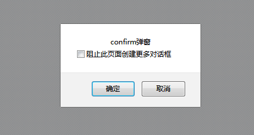

```html
<!DOCTYPE html>
<html lang="en">
<head>
    <meta charset="UTF-8">
    <title>操作confirm弹窗</title>
</head>
<body>
    <input id="button" type="button" onclick="confirm('confirm弹窗');" value="点击按钮弹出confirm弹窗"/>
</body>
</html>
```
*上述代码展示的图片*



```py
from selenium import webdriver
import unittest,time
from selenium .common.exceptions import NoAlertPresentException

class ConfirmWindowByChrome(unittest.TestCase):
    def setUp(self):
        self.driver = webdriver.Chrome()
        self.driver.implicitly_wait(10)

    def test_radioConfirm(self):
        url = "D:\pycharm\API-Exercise\webDriverApi\confirm.html"
        self.driver.get(url)
        self.driver.maximize_window()
        
        #定位并点击按钮，使其显示confirm弹窗
        button = self.driver.find_element_by_id("button")
        button.click()
        try:
            #获取alert对象
            alert = self.driver.switch_to.alert
            time.sleep(2)
            #使用alert.text属性获取confirm中的内容并进行断言是否是confirm弹框
            self.assertEqual(alert.text, "confirm弹窗")
            #使用alert对象的accept()方法，模拟鼠标点击“确定”按钮
            alert.accept()
            #此方法模拟鼠标点击“取消”按钮
            #alert.dismiss()
        except NoAlertPresentException as e:
            self.fail("confirm弹窗未找到")
        print('e')

    def tearDown(self):
		#退出浏览器
        self.driver.quit()

if __name__ == '__main__':
    unittest.main()
 ```
 
