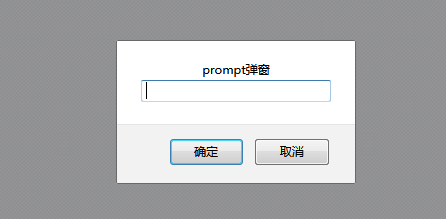

```html
<!DOCTYPE html>
<html lang="en">
<head>
    <meta charset="UTF-8">
    <title>操作prompt弹窗</title>
</head>
<body>
    <input id="button" type="button" onclick="prompt('prompt弹窗');" value="点击按钮弹出prompt弹窗"/>
</body>
</html>
```
`html代码结果`



```py
from selenium import webdriver
import unittest,time
from selenium .common.exceptions import NoAlertPresentException

class PromptWindowByChrome(unittest.TestCase):
    def setUp(self):
        self.driver = webdriver.Chrome()
        self.driver.implicitly_wait(10)

    def test_radioPrompt(self):
        url = "D:\pycharm\API-Exercise\webDriverApi\prompt.html"
        self.driver.get(url)
        self.driver.maximize_window()
        #定位并点击按钮，使其显示prompt弹窗
        button = self.driver.find_element_by_id("button")
        button.click()
        try:
            #获取alert对象
            alert = self.driver.switch_to.alert
            time.sleep(2)
            #使用alert.text属性获取prompt中的内容并进行断言是否是prompt弹框
            self.assertEqual(alert.text, "prompt弹窗")
            time.sleep(3)
            #使用alert.send_keys()方法，在输入框中输入
            alert.send_keys("自动化测试")
            time.sleep(2)
            #使用alert对象的accept()方法，模拟鼠标点击“确定”按钮
            #alert.accept()
            #此方法模拟鼠标点击“取消”按钮
            alert.dismiss()
        except NoAlertPresentException as e:
            self.fail("prompt弹窗未找到")
        print('e')

    def tearDown(self):
		#退出浏览器
        self.driver.quit()

if __name__ == '__main__':
    unittest.main()
    
 ```