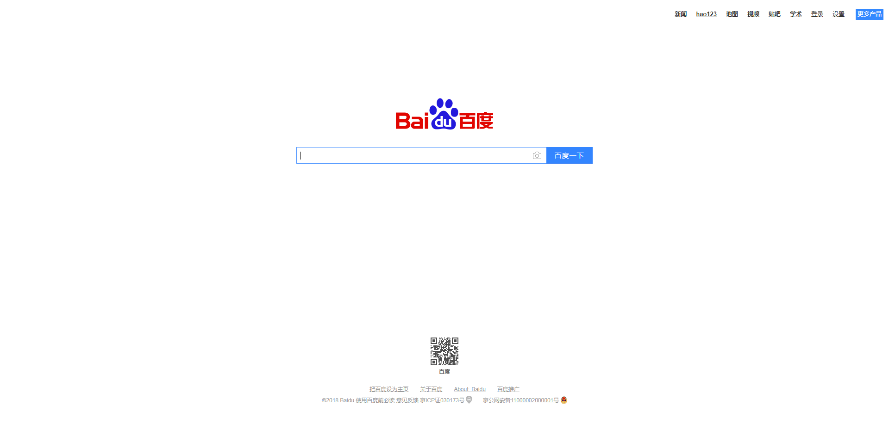

```py
from selenium import webdriver
import unittest, time

class CheckManyBoxByChrome(unittest.TestCase):

    def setUp(self):
        self.driver = webdriver.Chrome()
        self.driver.implicitly_wait(10)

    def test_operateCheckBox(self):
        url = "http://www.baidu.com"
        self.driver.get(url)
        self.driver.maximize_window()
        try:
            #对当前页面进行截图，并保存在下方设置的路径中命名为sceeenPicture.png
            testResult = self.driver.get_screenshot_as_file\
                (r"D:\pycharm\API-Exercise\webDriverApi\screenPicture.png")
            print(testResult)
        except IOError as e:
            print(e)

    def tearDown(self):
        # 退出浏览器
        self.driver.quit()

if __name__ == '__main__':
    unittest.main()
 ```
 
	截图效果如下：



*注意*

	截图成功后会返回**True**，如果发生了IOError异常，会返回False;
	函数中传递的图片的路径可以是相对路径也可以是绝对路径
	

