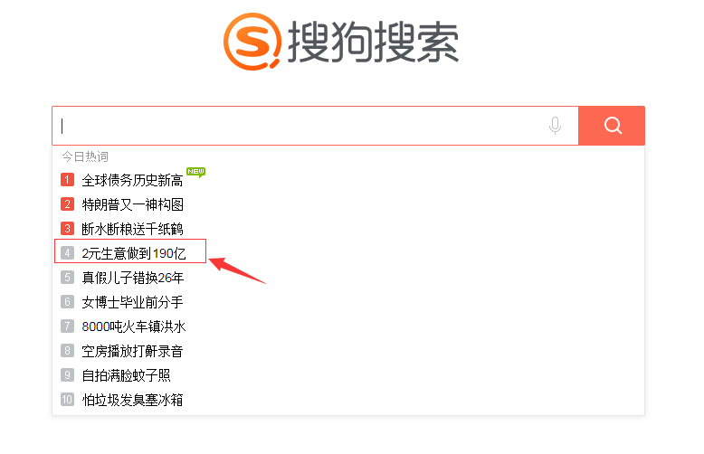

	*方法一*
```py
from selenium.webdriver.common.keys import Keys
from selenium import webdriver
import unittest, time

class OperateAjaxByChrome(unittest.TestCase):

    def setUp(self):
        self.driver = webdriver.Chrome()
        self.driver.implicitly_wait(10)

    def test_ExecuteAjax(self):
        url = "http://www.sogou.com/"
        self.driver.get(url)
        self.driver.maximize_window()
        #找到搜索输入框并点击，如果有历史记录就先清除
        searchInputBox = self.driver.find_element_by_id("query")
        searchInputBox.click()
        #添加等待时间，让悬浮框加载完成
        time.sleep(2)
        for i in range(4):
            #选择悬浮框中的第几个关键词就循环几次，并模拟键盘单击下箭头
            searchInputBox.send_keys(Keys.DOWN)
            time.sleep(1)
        #模拟键盘按回车键，选中该项
        searchInputBox.send_keys(Keys.ENTER)
        time.sleep(3)

    def tearDown(self):
        # 退出浏览器
        self.driver.quit()

if __name__ == '__main__':
    unittest.main()
```



	*方法二*
	因为浮动框的内容随时变化，如果想固定选择浮动框中的某一项，则可使用以下方法
	
```py
from selenium.common.exceptions import NoSuchElementException
from selenium import webdriver
import unittest, time
import traceback

class OperateAjaxByChrome(unittest.TestCase):

    def setUp(self):
        self.driver = webdriver.Chrome()
        self.driver.implicitly_wait(10)

    def test_ExecuteAjax(self):
        url = "http://www.sogou.com/"
        self.driver.get(url)
        self.driver.maximize_window()
        try:
            #找到搜索输入框并点击，如果有历史记录就先清除
            searchInputBox = self.driver.find_element_by_id("query")
            searchInputBox.click()
            #添加等待时间，让悬浮框加载完成
            time.sleep(2)
            suggetionOption = self.driver.find_element_by_xpath("//*[@id='vl']/div[1]/ul/li[4]")
            suggetionOption.click()
            time.sleep(3)
        except NoSuchElementException as e:
            #打印异常堆栈信息
            print(traceback.print_exc())
        
    def tearDown(self):
        # 退出浏览器
        self.driver.quit()

if __name__ == '__main__':
    unittest.main()

```

	注意：索引是从1开始的