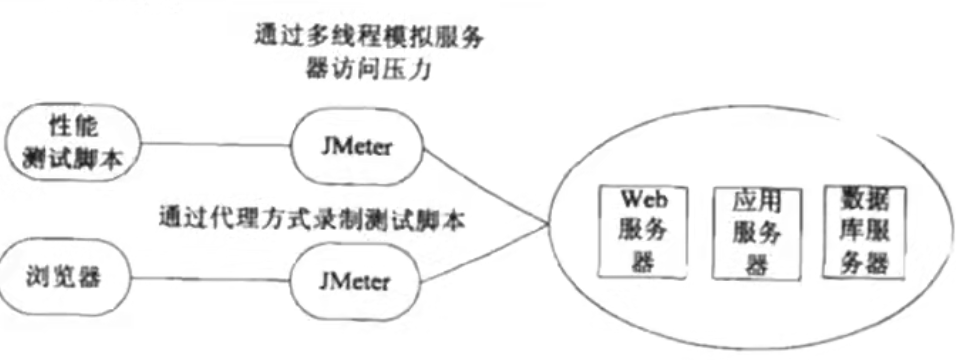
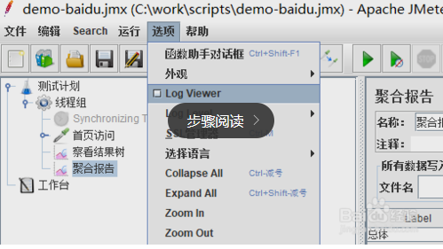
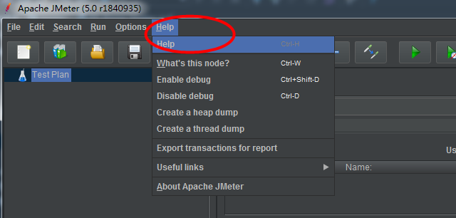
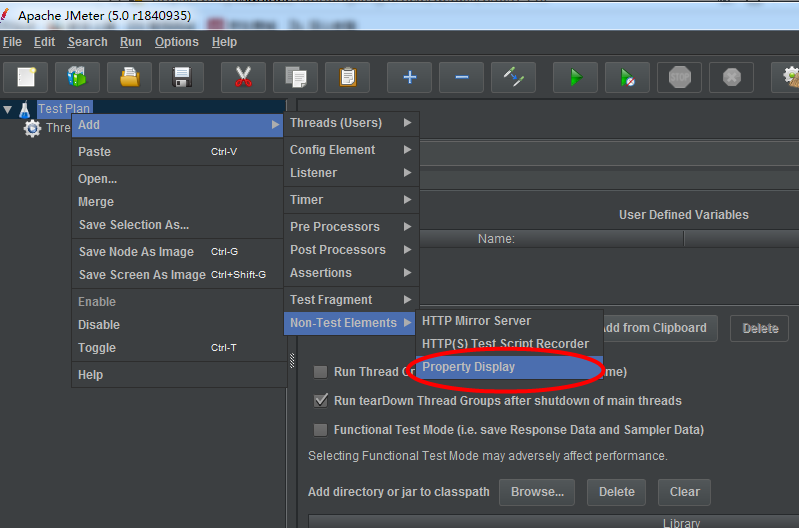
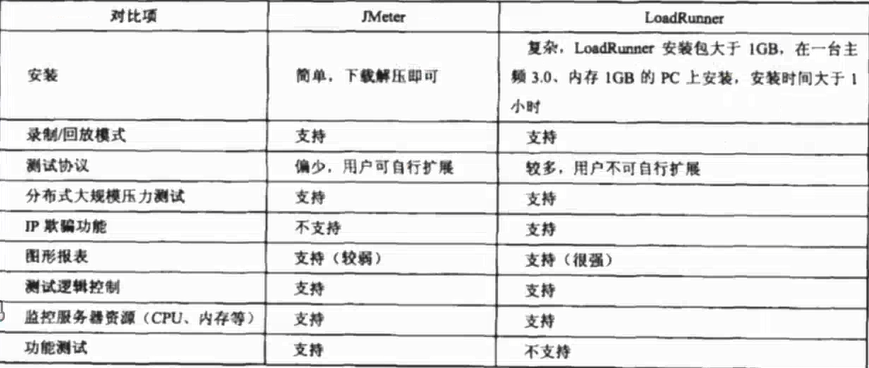

1、JMeter是什么

    * Apache JMeter是Apacher组织开发的基于java的压力测试工具
    
    * JMeter 可以用于对服务器、网络或者对象模拟巨大的负载，来自不同压力类别下
      测试他们的强度和分析整体性能。另外JMeter能够对应用程序做功能/回归测试，
      通过创建带有断言的脚本来验证你的程序返回了你期望的结果。为了最大限度的灵
      性，JMeter允许使用正则表达式创建断言。
      
2、JMeter的特点

    * 能够对HTTP和FTP等服务器进行压力和性能测试，也可以对任何数据库进行同样的测试(通过JDBC)
    
    * 完全的可移植性和100%纯java
    
    * 完全多线程框架允许通过多个线程并发取样和通过单独的线程组对不同的功能同时取样    
    
    * 各种负载统计表和可链接的计时器可供选择(跟LR相比不够友好以及丰富)
    
    * 数据分析和可视化插件提供了很好的可扩展性以及个性化(不是商业性的可扩展性好)
    
    * 具有提供动态输入到测试的功能
    
3、JMeter和JDK的下载安装

    * 较简单只要安装JMeter以及JDK即可，可参考下面的安装方式
    
转载自：https://blog.csdn.net/a13124837937/article/details/79628838  

https://www.cnblogs.com/xingfan/p/7250559.html  

    注意点
    1、前置条件：jdk安装好
    2、一般启动：解压，bin目录里的jmeter.bat即可，cmd窗口要以管理员身份开启
    3、服务器模式启动：jmeter-server.bat.允许在远程节点上以服务器模式运行jmeter,
       并通过jmeter gui来控制
       
4、JMeter工作原理

    LR较于JMeter录制功能强大
    
5、JMeter目录结构

    * bin目录是可执行文件，jmeter.bat启动， 里面可以设置jvm参数
    
    * 根据经验,heap(堆内存)最多设置为物理内存的一半，默认设置为521M。如
      果heap超过物理内存的一半，可能运行jmeter会慢，甚至出现内存溢出。
      
    * jmeter的log在jmeter.log中查看
    
    * jmeter.properties文件中有一个log_level.JMeter，可以设置改变日志
      的详细程序。默认是info,可改为debug.
      
在JMeter查看日志

    * docs目录下可以查看api
    
    * printable_docs目录中 usermanual子目录下是jmeter用户手册，其中
      component_reference.html是最常用的和元件帮助手册。
      
工具下查看帮助手册

    * extras目录下的文件提供对ant的支持，可以利用ant来实现自动化，例如
      批量执行脚本，产生htnl报告等。
      
    * 运行jmeter的时候会产生一个jtl文件，把它放到extras目录下，运行ant-Dtest=文件名
      report就会生成测试统计报表
      
    * lib目录下的ext子目录是jmeter的核心jar包；junit目录是放junit脚本的，用户扩展所
      依赖的包直接放到lib下即可，不要放到lib/ext下。
      
工具下查找属性展示(Property Display)

    
    可在上图的位置修改属性
    
6、JMeter和LR的比较

    * jmeter支持的协议相对较少
    * 图形报表生成较复杂
    * LR中可以支持c语言脚本，来实现功能测试
      
    
