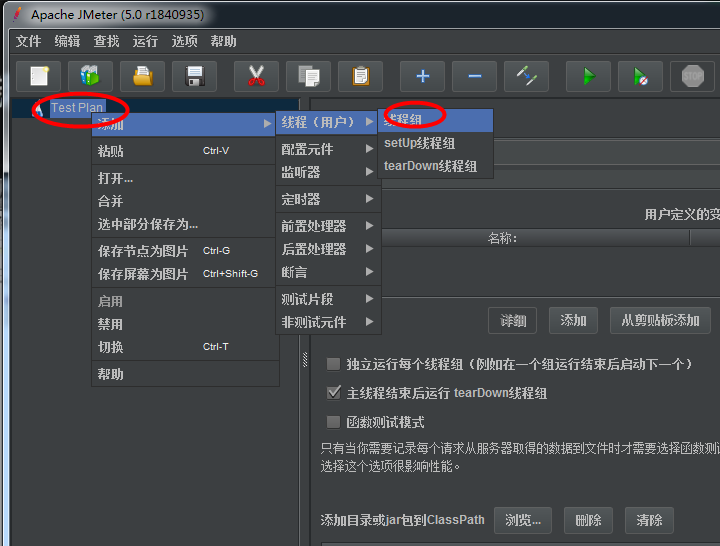

常用功能：

    jmeter的目录，它执行的东西是依靠左侧目录树，整个测试以测试计划为基础进行测试
    
测试计划：

    用来描述一个性能测试，所有内容都是基于这个计划
    
线程组：

    一般常用线程组，可以理解成为虚拟用户组(也理解成LR的虚拟用户)
    
    
setup thread group,teardown thread group和线程组没什么区别，但他们有以下两个特点

    * setup thread group: 可用于执行预测试操作。这些线程的行为完全像一个正常的
      线程组元件。类似LR的init元件。
      
    * teardown thread group元件：可用于执行测试后的动作，这些线程的行为完全像一
      个正常的 线程组元件。类似于LR中的end.
      
    * Sample(取样器):创建各种请求类型，用来模拟用户的请求，它是在线程组下面创建的，
      如果没有创建线程组是看不见的。
      
    * 逻辑控制器：类似编程语言里的if,for等
    
    * 定时器；用于设置操作之间的等待时间，类似于LR中的思考时间。但不同的是，jmeter
      的定时器，一旦设置对所有的请求都生效
      
    * 前置处理器： 用于在实际请求发出之前，对即将发出的请求进行特殊的处理。比如参数化(多请求)
    
    * 后置处理器： 对发出请求后得到的服务器响应进行处理，比如关联(比如：请求一有两个参数发送后
       响应回来了，请求二发送时需要请求一的响应内容，这要用关联获取到然后传递。再比如你进行登录，
       或某些操作，需要token值的校验，因为每次登录，每次操作token值都会变，那就必须每一次都捕获
       到这个动态的token值，才能通过我们服务器的校验，否则失败)
    
    * 断言：就是LR中的检查点，用于检查测试中得到的响应数据等是否符合预期
    
    * 监听器：对测试结果数据进行处理和可视化展示，如查看结果树，聚合报告
    
    
      