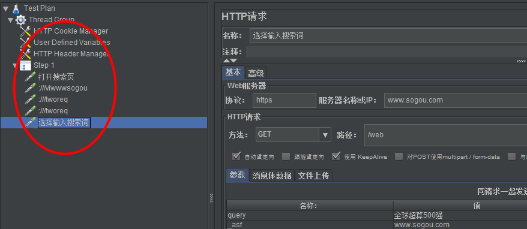
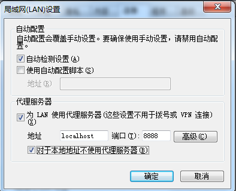

录制方式一：---badboy(推荐使用)

    * badboy下载： http://www.badboy.com.au/
    
介绍badboy：自动化测试工具

    1、默认打开是录制状态，需要停止录制，点击红圈
    
    * 打开badboy工具，点击工具栏目上的红色圆形按钮，在地址栏目中输入被测试项目地址
    
    * 录制完成后，点击工具栏旁边黑色按钮，结束录制。选择"文件" --Export to Jmeter...
    
    * 打开jmeter工具，选择"文件"-->"打开",选择刚才保存的文件(.jmx类型)，将文件导入进来了
    
    * 演示录制sogou.com

    
录制方式二: ---代理

    * 创建一个线程组(右键点击 "测试计划"--->"添加"--->"线程组")
    
    * 在"工作台" --非测试元件---"添加http代理服务器"
    
    * 代理服务器的端口默认是8080，可自行修改，但不要与其它应用端口冲突
    
    * 目标控制器： 录制的脚本存放位置，可选择项为测试计划中的线程组(根据实际来选择)
    
    * 分组对请求进行分组。
        -----分组的概念：将一批请求汇总分组，可以url请求理解为组
        --不对样本分组：所有请求全部罗列
        --在组间添加分隔：加入一个虚拟的以分隔线命名的动作，运行同  "不对样本分组"无实际意义
        --每个分组放入一个新的控制器：执行时按控制器的输出结果，"只存储每个组的第一个样本",
          对于一次url请求，实际很多次http请求的情况
    
    * 点击启动
    
设置ie代理

    * IE ----internet属性-----连接----局域网设置---勾选代理服务器下两个空格，并设置地址和端口号
    
    * 现在点击点击jmeter的启动按钮
    
    * 打开浏览器输入需要录制web项目地址
    
    * jmeter会自动记录你ie所访问的页面
    

    可以输入内容进行录制，但录制的结果会有一些额外的请求，易用性不好，可以用正则屏蔽请求，但不建议使用