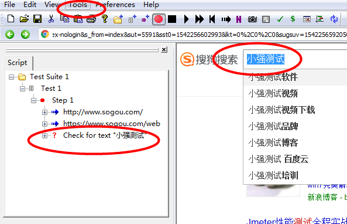
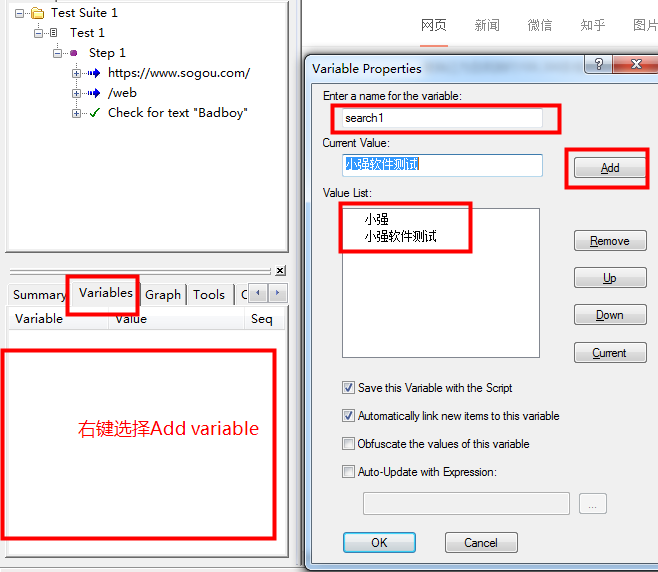
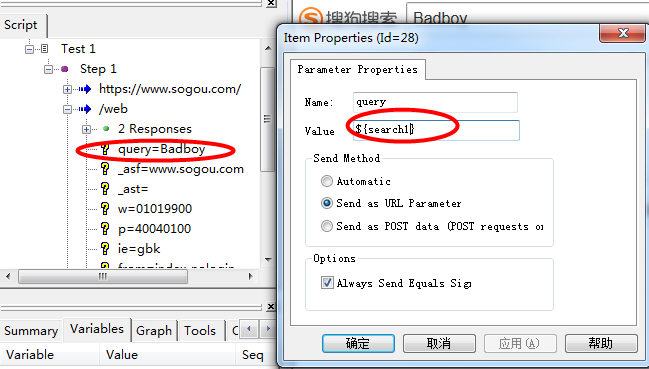
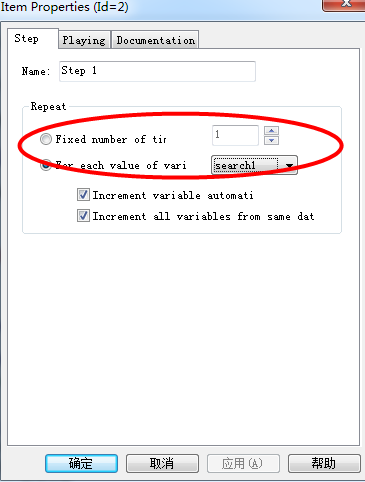
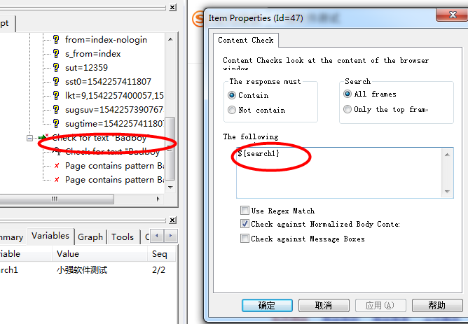
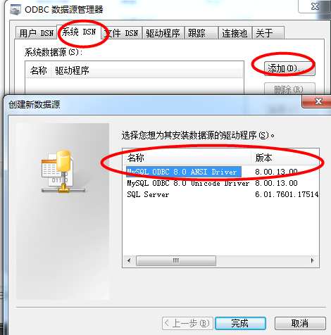
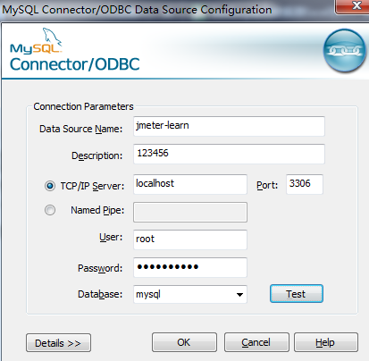

1、badboy检查点
    
    * 在搜索出来的页面选中搜索框文本
    
    * 选中之后在工具栏的Tools下拉列表中选中Add Assertsion for Selection
    

    * 点击工具栏"Play All"按钮(如果乱码在请求中将utf8改为gbk)
    
    * 回放通过
    
2、badboy参数化----下面的方式跟LR一样都为文本参数化

    * 建立参数化列表
    
    * 在请求中替换${参数名称}
    
    * 中文可能有乱码，改下请求中的编码格式
    
    * 左下方切换到"Variables"标签，在框中右键点击选择"Add Variable"
    
    * 写入名称、添加当前值，其它保持默认点击ok,此时参数化列表已完成
    

    * 现在需要到请求中替换，找到请求/web中Responses下的query关键字，右键选择Properties
    
    * 在弹框中Name值不要改变，Value改为上图中search1但格式需要改为${search1},其它保持默认
      注意：因为在这里只有搜索输入框的内容做参数好较好理解，但在工作，你需要自己确定哪些需
            要参数化的内容。

    

    * 回放因为有连两个参数，需要回放两次，所以要设置回放参数，点击Step1右键点击Properties
    
 

    * 点击"Play All"回放查看效果  (出现乱码和检查点)乱码和上面的同样操作改为gbk
      要想检查点跟参数进行变化:右键点击'Chect for text "badboy"'选择Propertier,将badboy该为参数的名字${search1}
      
 
  
    * 再次回放就解决了上述问题
    
3、同样badboy和LR都有数据库参数化

    * odbc 下载安装
    ---在网上百度下载一个是MYSQL数据库的ODBC驱动程序
    ---打开数据源：开始->设置->控制面板->系统和安全->管理工具->数据源(ODBC)
    ---在系统DNS中选中"添加"按钮，选中MySQL ODBC
    
  

    ---配置链接数据
 
  
    

    * data source放到 脚本最前端