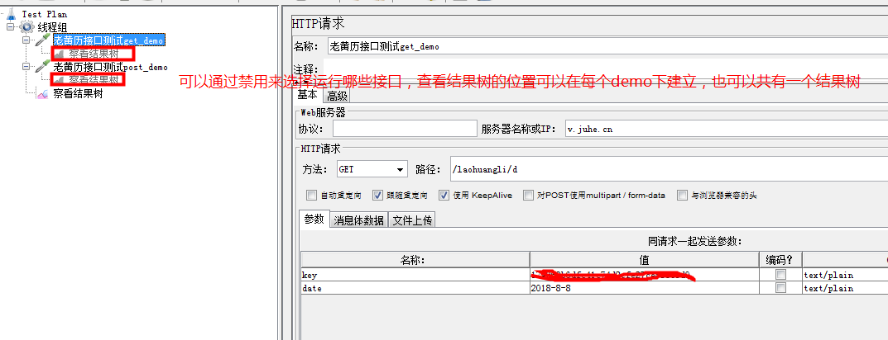
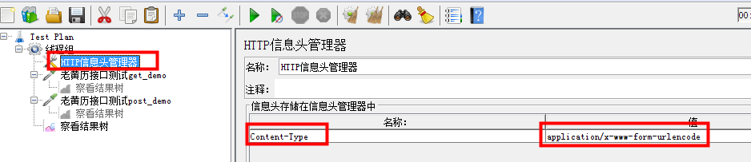
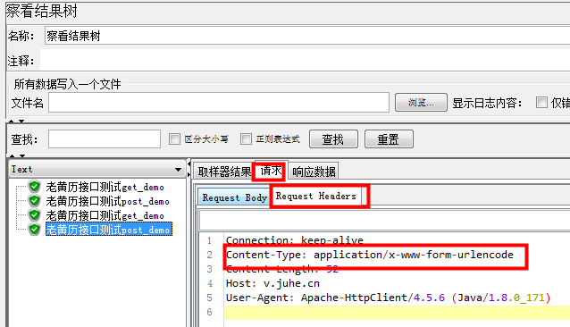
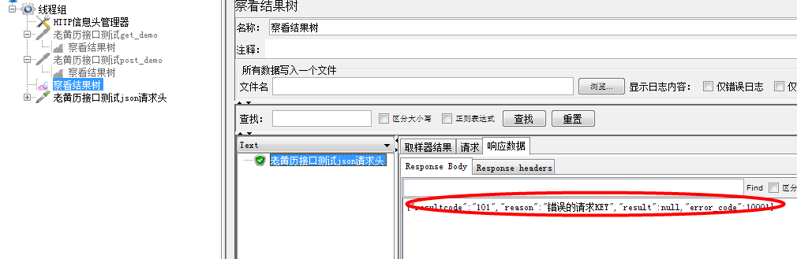
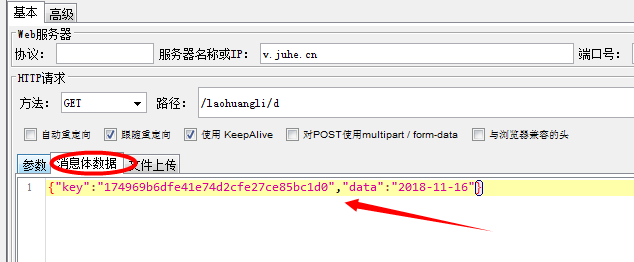

1、接口信息(接口文档规定格式)https://www.juhe.cn/docs/api/id/65

    接口地址：http://v.juhe.cn/laohuangli/d
    返回格式：json/xml
    请求方式：http get/post
    请求示例：http://v.juhe.cn/laohuangli/d?date=2014-09-11&key=您申请的KEY
    接口备注：日期开始时间为2010-01-01
    
    完整的接口测试地址：https://www.juhe.cn/docs/api/id/65
    
    请求格式为非json格式，可以不设置请求头
    

2、请求头(信息头)管理器

    常见的几种请求头：
    
        --- Contern-Type:application/json
        --- Contern-Type:application/x-www-form-urlencode
        --- Contern-Type:application/xml
        
    Contern-Type:application/x-www-form-urlencode的操作步骤：
    
    * 线程组---添加---配置元件--HTTP信息头管理器
    * 一般将请求头的位置拖拽到最前面
    * 点击运行
    

    Contern-Type:application/json的操作步骤
    
    * 参数的位置：需要以json格式写在Body Data(消息体数据中)
    * HTTP信息头管理器中的格式改为:application/json
    * 请求可以运行，但是返回参数是错误的 

    
