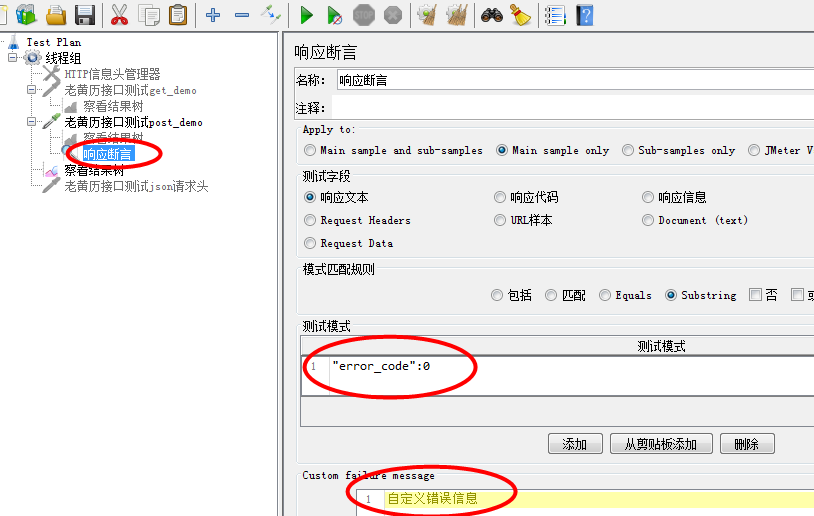
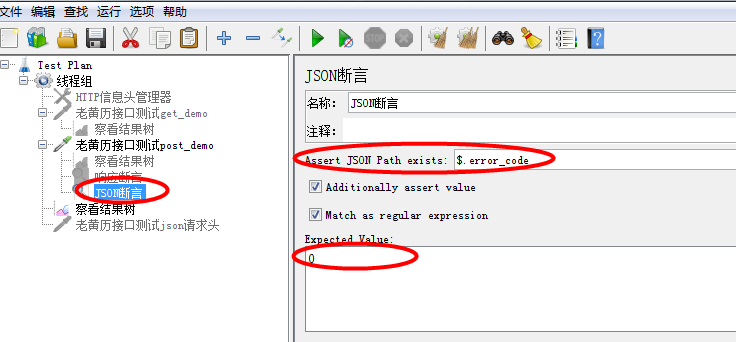
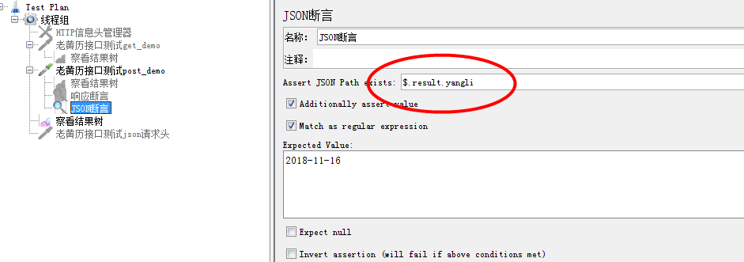

1、响应断言(实际结果和预期结果进行对比)

    操作步骤：
    * 对应接口右键----添加----断言---响应断言
    * 断言放在请求之下
    * 测试模式中添加需要断言的内容
    * 运行
    

2、JSON断言(只针对返回或者响应数据为json格式的进行断言)

    操作步骤：
    * 对应接口右键----添加----断言---JSON断言
    * Assert JSON Path exists: 输入框中填入你想检查的字段($.需要保留)
    * 勾选下方的两个单选框
    * Expected Value:输入框中输入期望值  
    * 运行
    

注意：Assert JSON Path exists

    上述的返回格式为：
    {
    "reason": "successed",
    "result": {
        "id": "1657",
        "yangli": "2014-09-11",
        "yinli": "甲午(马)年八月十八",
        "wuxing": "井泉水 建执位",
        "chongsha": "冲兔(己卯)煞东",
        "baiji": "乙不栽植千株不长 酉不宴客醉坐颠狂",
        "jishen": "官日 六仪 益後 月德合 除神 玉堂 鸣犬",
        "yi": "祭祀 出行 扫舍 馀事勿取",
        "xiongshen": "月建 小时 土府 月刑 厌对 招摇 五离",
        "ji": "诸事不宜"
    },
    "error_code": 0
}

    如果要检查"yangli",需要注意层级，它是在result下的(格式为$.result.yangli) 
    
   

3、断言持续时间：响应时间大于你设定的毫秒数就错误

    -----------------
    
4、Size Assertion：对返回的内容的大小做判断

    