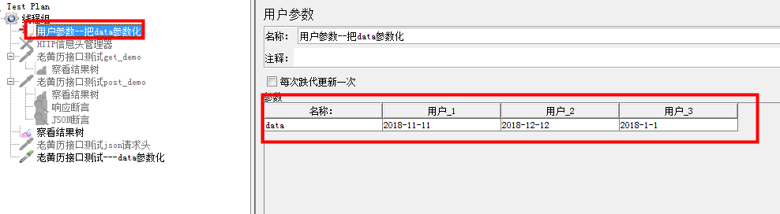
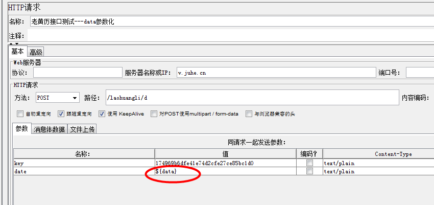
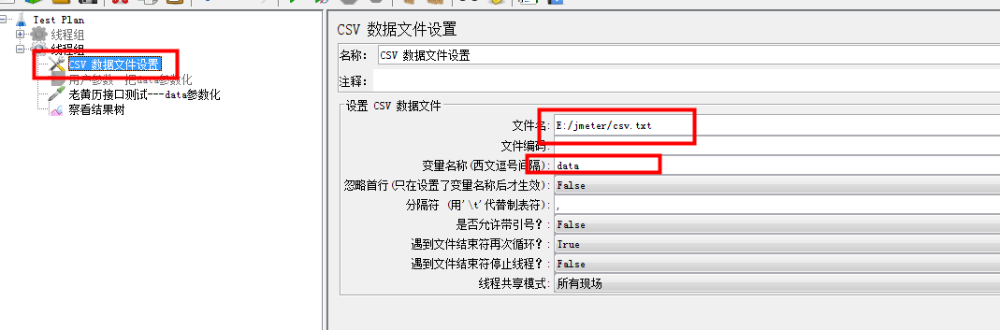

1、参数化方式一

    操作步骤；
    * 线程组---添加---前置处理器---用户参数
    * 将其拖拽到线程组下
    * 添加变量和添加用户
    * 替换参数，注意格式${参数名称}
    * 线程组中该线程数
    

2、常用参数化方式二

    操作步骤；
    * 线程组---添加---配置元件---CSV数据文件设置(远程调用实现参数化)
    * 将其拖拽到线程组下 
    * 设置好文件内容放在一个文本中】
    * 选择文件路径导入(如果文件内容没有中文可以不设置)
    * 输入变量名称，其它默认
    * 不要忘记替换变量

 
       
    

3、也可以使用函数助手    

    