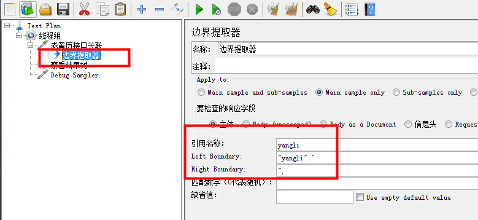
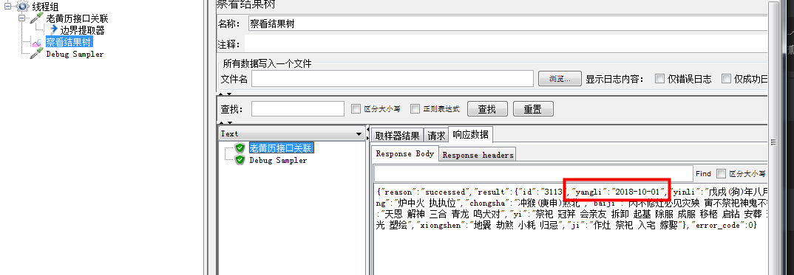
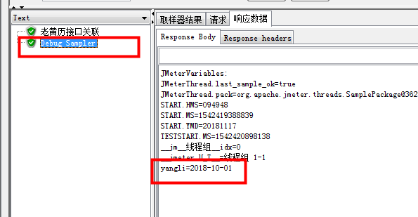
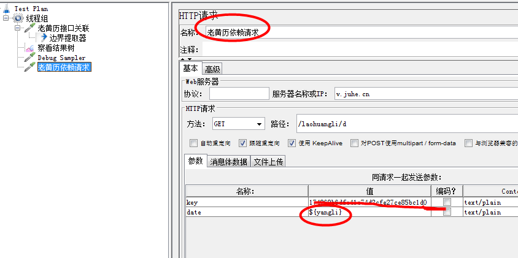
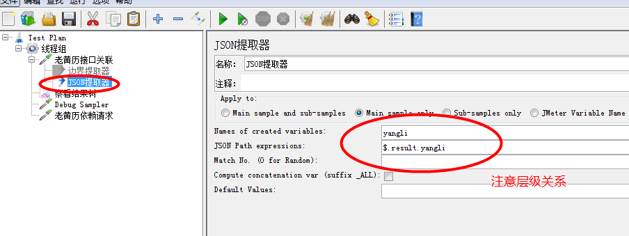

关联(解决请求依赖)

    比如A接口请求之后会得到响应，而B接口请求需要用到上一个请求响应的内容，就需要关联。
    即A接口中的响应参数需要作为B接口的请求参数(目的就是抓取动态变化的响应数据)
    
关联实现有三种方式

    * 正则表达式
    * 左右边界值
    * 特定的JSON Extractor
    
左右边界值

    步骤：
    * 新建一个http请求
    * 比如要取这个请求响应内容中"yangli"的值
    * 对应请求中右键---后置处理器---边界提取器
    * 输入引用名称："yangli"
    * 响应数据中查找左右边界并且填入
    * 便于调试可以加入一个debug sample(在这里可以查看获取到的关联值)
    

    * 新建一个请求使用关联的参数
    * 使用关联请求参数${yangli}
    

特定的JSON Extractor

    * 对应请求中右键---后置处理器---边界提取器
 
   

    * 关联参数的方式和上面一致