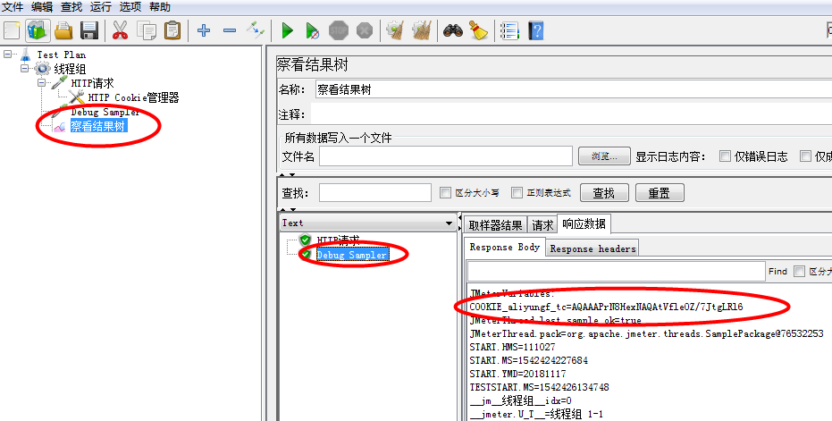
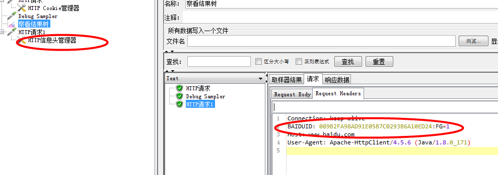
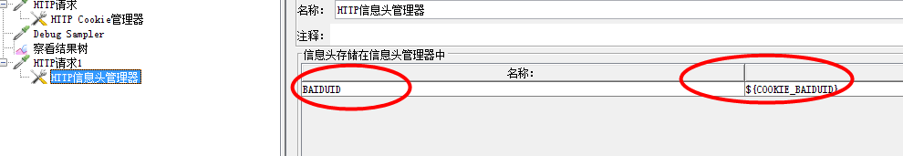

cookies 的自动管理

    使用HTTP Cookies管理器
    * 存储在用户本地终端上的数据通常情况下，当用户结束浏览器会话时系统将
      终止所有的Cookie.当Web服务器创建了Cookies后，只要在其有效期内，当
      用户访问同一个web服务器时，浏览器首先要检查本地的Cookies,并将其原
      样发送给Web服务器。(匹配字段是否成功，有就成功)
      
    * Cookies应用最典型的是判定注册用户是否已经登录网站，用户可能会得到提示，是否
      在下一次进入此网站时保留用户信息以便简化登录手续，这些都是Cookies的功能。另
      一个重要场合是"购物车"之类的处理，用户可能在一段时间内在同一家网站的不同页面
      中选择不同的场合，这些信息都会写入Cookies,以便在最后付款时提取信息。
      
  jmeter自动管理cookies步骤
  
    * 修改jmeter的配置文件(bin/jmeter.properties)，将"#CookieManager.save.cookies=false"
      修改为"CookieManager.save.cookies=true"
    * 重启jmeter，使其生效
    * 完成上述操作后，要想获取某个cookies的值，可以使用${COOKIE_cookies的名字}，这样就可
      在任意地方使用了，不过一般不需要这样操作，因为jmeter的自动管理cookies的功能已经能帮
      我们完成大部分情况了
      
    * 比如我们访问了百度，需要保存cookies
    * 先新建访问百度的http请求、查看结果树、debug sample
    * 线程组---添加---配置元件---HTTP Cookie 管理器,添加后不需要做任何操作，它会自动管理
    * 可以运行后在debug sample中响应数据中查看得到cookies
    
如果请求2依赖于请求1的cookies的，可以直接写请求2该怎么操作还是怎么操作，不需要再管cookies

上述方式可以完成大部分cookies的依赖，但还有另外一种情况需要获取某个cookie的值

    * 新建一个http请求
    * 添加http信息头管理器
    * 从上一个请求中获取名称(BAIDUID)和value值($COOKIE_BAIDUID)填入信息头管理器中
    * 运行请求查看请求
    

