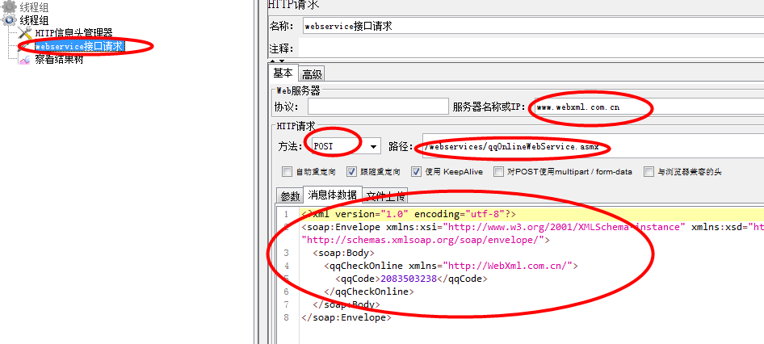
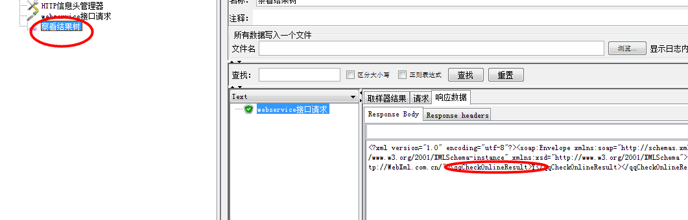
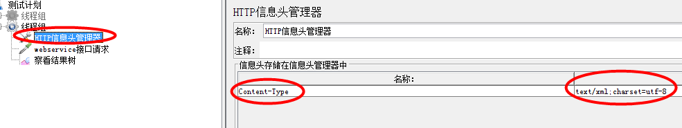
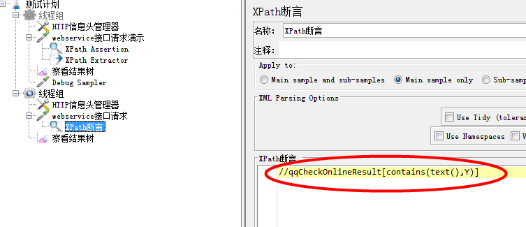

1、webservice接口是通过SOAP协议完成通信的，以xml格式传递的

    ----------------------------
    
接口文档地址： http://www.webxml.com.cn/webservices/qqOnlineWebService.asmx?op=qqCheckOnline

    操作步骤：
    * 新建线程组---添加http请求
    * 添加http信息头管理器(Content-Type:test/xml)
    * 请求中添加各种参数(ip，请求方法，路径，消息体数据)
    * 运行查看请求结果
    

2、xpath assertion断言

    * 添加---断言---Xpath断言
    * 查看接口文档选择需要断言的标签，取出标签的值
    * 写入断言，运行(注意格式的输入)

3、使用Xpath Extractor关联

    * 添加---后置处理器----Xpath2 Extractor
    * 填入引入名称进行存储变量
    * XPath query:写入路径其中*代表在任意标签中查找 "local-name="后面接的就是tagname，这样就可以获取到值
    * 添加debug sample拿到result
    * 如果接口之间存在关联就需替换请求参数 

