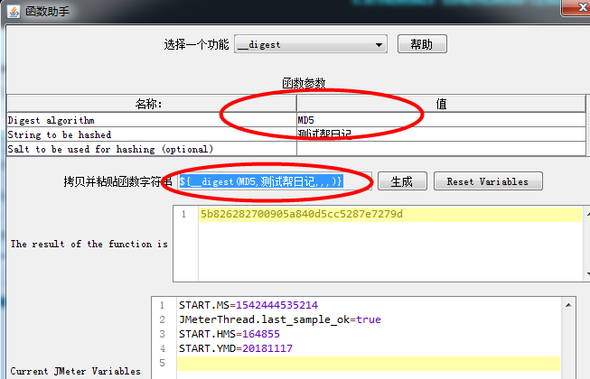

Jmeter调用第三方jar包

    有时候我们在测试接口的时候需要调用第三方jar包来完成，比如某些数据需要加密的jar包，
    在jmeter中就可以方便的完成
    
    操作步骤：
    * 获取需要调用的jar包（向开发拿jar包）
    * jmeter右键测试计划---点击右侧浏览----打开你拿到的jar包添加进去(或者直接将jab包放入到lib或lib/ext目录下)
    * 线程组---添加---取样器(sampler)---bean shell sampler
        在bean shell的需要写脚本，则先向开发索取包名，class名称，有什么方法，需要传递什么参数
    * 添加debug sampler   
    * 在jmeter中需要用到该值的地方直接使用即可${md5}
    
比如接口中的某个参数(登录密码)需要加密之后服务器才可以进行接收就可以使用jar

请求参数需要MD5进行加密，在jmeter中利用函数助手对话框

    * 选项----函数助手对话框---找到__digest
    * 在里面输入参数内容
    * 在要用到的地方调用即可
 

   

   
   