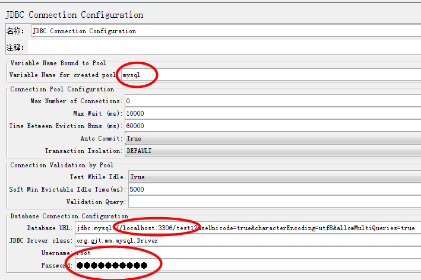
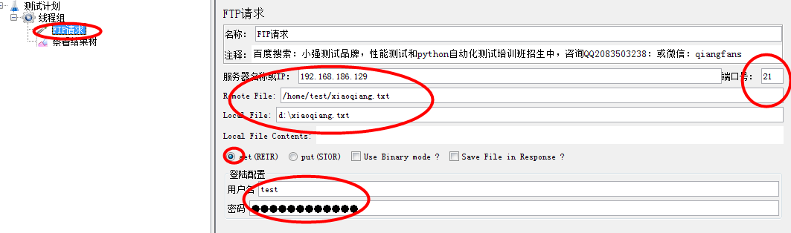

JDBC测试mysql数据库

    操作步骤：
    * 线程组---添加---sampler---JDBC Request
    * 线程组---添加---配置元件---JDBC Connection Configuration---配置里面的内容
    

    * 测试计划中添加connect.jar包
    
    
FTP上传下载

    * 确定连接的服务器上有没有FTP server，ip,端口号向开发拿
    * Remote File 远程路径是固定的向开发拿，Local File 本地地址
    * 选择get为从远程下载(获取)资源，put就是把本地文件上传到远程服务器上
    * 有些FTP服务器需要输入登录配置，如果不需要就为空
    * 根据接口文档建立请求,运行
    * 可在保存文件的路径查看结果
    

    
    
    