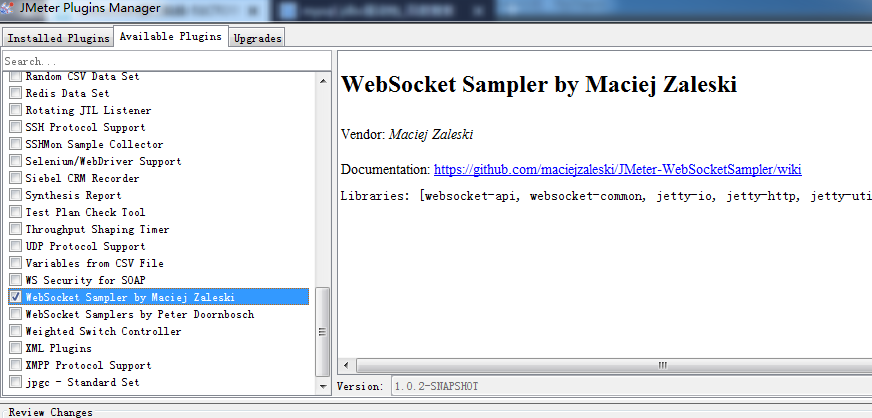
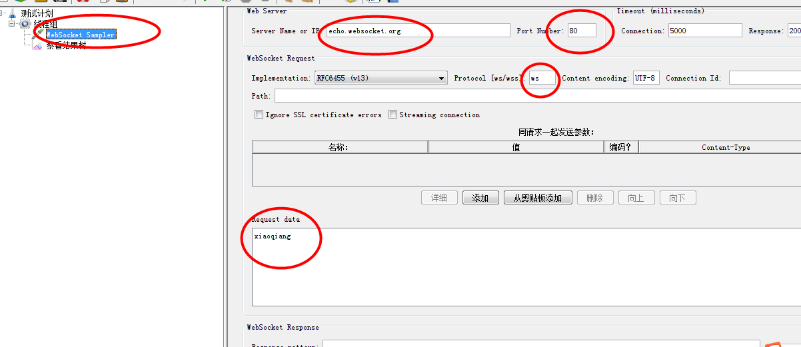
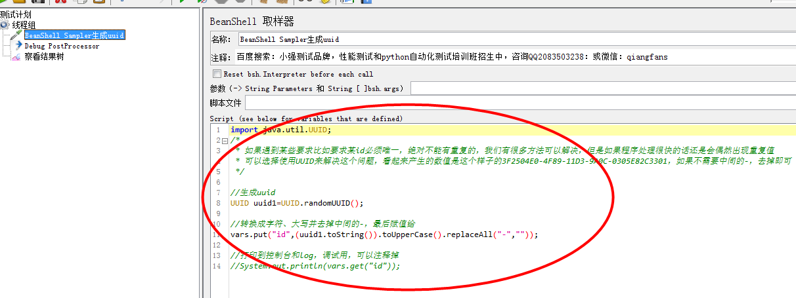

1、WebSocket测试

    是一种双向通信协议，在建立连接后，WebSocket服务端和客户端都可以主动向对方
    发送或接受数据，而在HTTP协议中，一个request只能有一个response，而这个response也是被动的，不能主动发起。
    
安装插件

测试网址：http://www.websocket.org/echo.html

    原理：你发送一个socket信息给它，然后接收后原样返回给你
    网址为：echo.websocket.org
    协议是：ws
    
操作步骤：

    * 添加websocket sampler 输入信息IP:echo.websocket.org,端口：80，协议：ws
    * request data:输入你要传上去的东西
    
    
注意：

    协议：ws/wss,wss是在websocket连接之后进行加密传输，根据实际来写
    端口：ws80,wss443跟http和https道理一样的
    Streaming Connection:请求之后是否保持连接，勾选之后在同一次http内继续回话
    通俗的说就是没有勾选发送请求后就会断开连接
    需要传递参数的方式和http参数一样的
    
 

2、BeanShell Sampler生成唯一数UUID

    可以用随机数生成，但是在高并发，生成速度快的情况下有可能会产生两个相同的数的
    这样就违反了id的唯一性。
    
 

可以使用函数助手生成
    
    
        