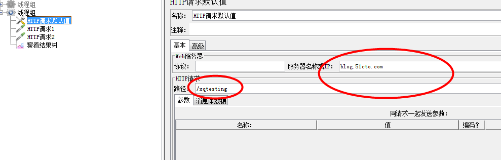
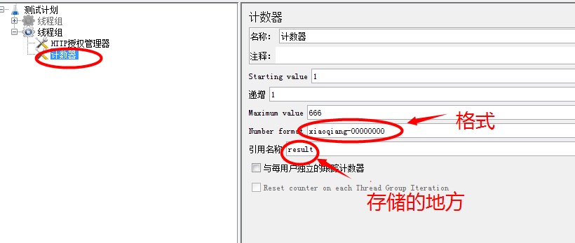

1、HTTP请求默认值：设置http的请求的缺省参数或默认值可以在这里设置，就不用多次设置了

    其它请求的默认值用法一致
    
2、HTTP授权管理器：理解为用户名密码验证的过程，比如需要提供凭证，

    需要授权机制的向开发拿：基础URL，用户名，密码必填，其它为选填
    可以用tomcat尝试操作adminconsole
    
3、计数器

    一般勾选“与每用户独立的跟踪计数器”达到每个线程独立运行，准确性更高
    
