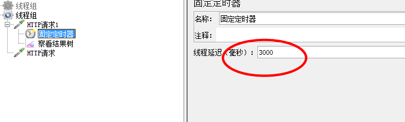
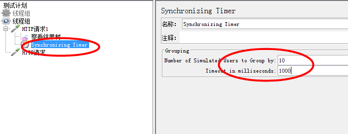
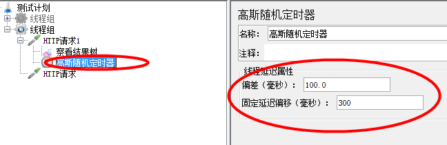

1、固定定时器：比如登录需要等待时间，这样就可以设置固定定时时间准备数据

    * 定时器一定要在sampler之前执行
    * 如果希望定时器作用在某个请求，就要放在某个请求的子节点上
    
 
 
2、同步定时器相当于LR中的集合点(synchronizing timer)

    集合点：设置了一个关卡，要求必须等到有十个人才放行
    
    * 第一个输入框：如果输入10，则表示当有十个线程到达的时候就释放
    * 第二个输入框：超时时间，如果输入1000毫秒，指的是超过1000毫秒后释放线程数
    
    两个选项之间的关联：如果只有九个线程到达，但是超过1000毫秒后第十个线程还没集合就会丢掉这个线程，释放九个线程    

     
 
 3、高斯随机定时器：在一个范围内随机定时
 
    * 偏差输入100，固定延时偏差输入300，表示是在100—400(100+300)毫秒之间随机取的
    在需求中一般是设定固定定时的思考时间
 
   
        