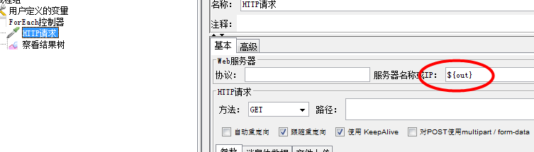
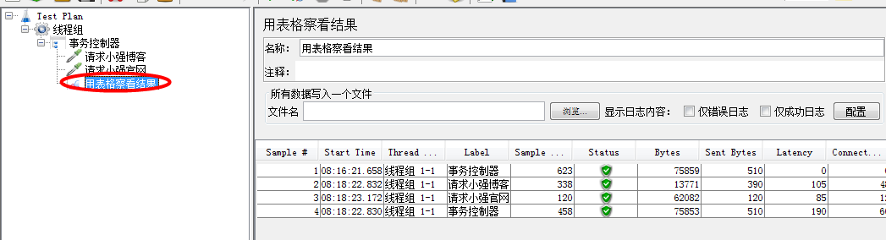

1、简单控制器

    无任何实际作用，也不参与脚本运行，就是一个分组或者打标签的用途
    
2、foreach控制器

    * 和用户自定义变量成套使用的，控制器从一系列变量中读取相关的值
      让我们的控制器下的子节点取执行
      
    操作步骤：
    * 用户参数中：添加变量(名称要规范"***_1,***_2,***_3....")
    * 添加控制器
    * 输入变量前缀("***"跟用户参数匹配),输出变量名称可以自定义，用来保存值
    * 勾选Add"_" before number
    * 起始索引和结束索引可以不设置
    

    
3、switch控制器：相当于开关，只可以指定其中一个访问

    * 通过设置switch value的索引值(从0开始)来指定到底指定那个节点(小强博客还是小强官网)
    * 也可以通过名称指定访问请求
    

4、if控制器：满足什么运行什么

    操作步骤
    * 用户自定义变量   名称和值
    * if控制器中输入条件进行指定访问的请求，注意格式，是字符串之间的比较
    * 下面的选项都不勾选
    * 关联用户自定义的变量值进行访问请求
    
经常用于一个请求用于get请求还是post请求

5、事务控制器：统计子节点运行的时间的

    * 事务控制器中勾选"Generate parent sample"表示统计所有的，不勾选表示每个分别统计
    用表格查看结果树查看
    
    * 第二个勾选了会计算进思考时间，一般不勾选
    

6、循环控制器：控制子节点的次数，就是运行的次数

    如何循环次数设置为5，线程组的线程数为2，则运行2*5=10次

    
 
7、吞吐量控制器：控制子节点运行次数，比如控制某个访问运行两次

    步骤：
    * 线程组设置循环次数为5
    * 吞吐量控制器中设置一个请求为3次，一个请求为2次即可，可使用百分比或者次数的方式
    
  
 
      

