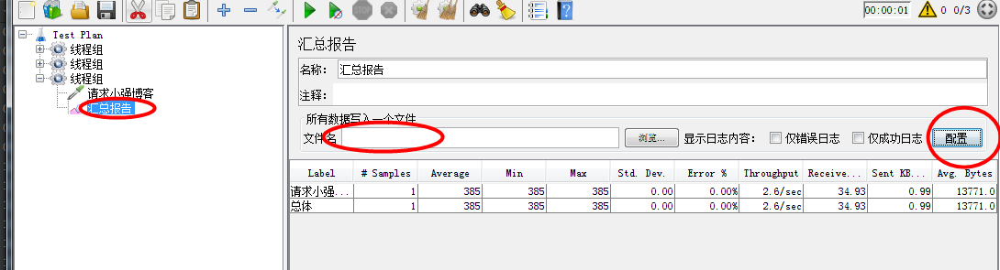
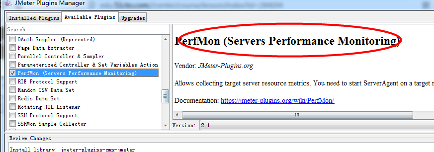
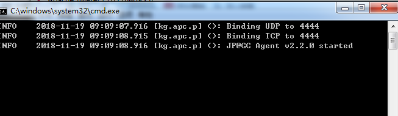
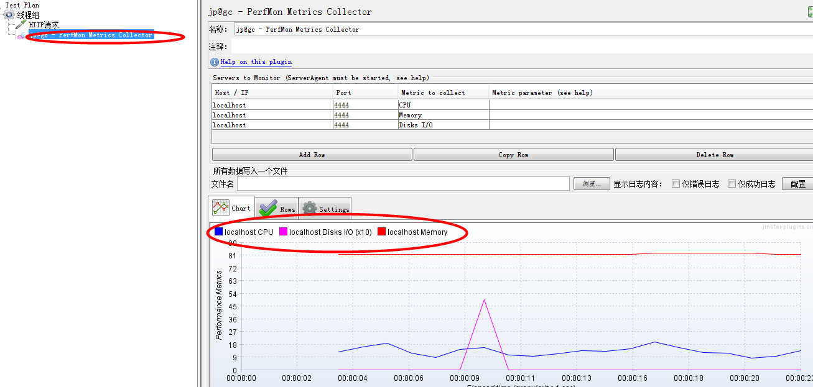

注意：查看结果树在实际过程中，一般都要关闭的，只是用来调试脚本的

    监听器------------------
    
1、Summary Report(汇总报告)

    名称意义：
    * Label:  对应每个请求的名称
    * Samples: 取样器运行的次数
    * Average,Max,Min：响应时间的平均值，最小值，最大值
    * Std. Dev.:标准差， 标准差越小运行的越稳定，越大波动也大
    * Error: 错误率
    * Throughput: 吞吐量
    * Receive...，Sent...,Avg...:接收和发送出去的流量,平均值
    
可以选择配置选项，可以选择勾选你需要的数据，如果要保存可以写入文件名

2、聚合报告

    跟汇总报告相比多了一个响应时间的记录
    
3、邮件观察仪

    注意不要添加太多监听器，如果并发量多的情况下，记录就会出现问题
    
    * From 发送地址
    * Addressee 接收地址
    * Success Subject: 发送成功后主题
    * Failure Subject: 发送失败后主题
      只能通过选择的个数来判定  
      
4、PerfMon Metrics Collector监控器：监控服务器资源的cpu,内存，IO

    步骤：
    * 安装插件
    
 
 
    * 安装serveragent包，你需要监控那个服务器就需要在那个服务器上启动server agent
    * 在windows下，下载serveragent包在本地，然后双击启动startAgent.bat,在Linux中就
      启动startAgent.sh
 
 
    * jmeter中添加线程组，监控器
    * Add Row ： 添加row就是你需要监控的指标(),可以指定文件名保存，然后分析
    * 线程组中循环次数勾选永远可以长时间运行，因为搜集数据需要时间
    * 添加请求
    * 监控远程要改ip,把serveragent扔上去
    
 