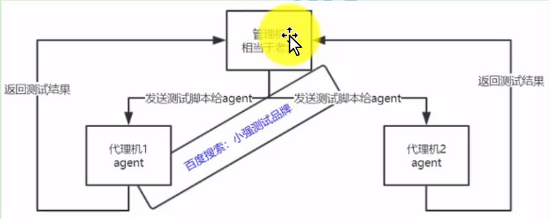

jmeter分布式测试用于性能并发测试
    
    因为jmeter本身的限制，想在一台机器上并发较大用户时，(大概3000，要看配置)可能会卡死
    所以需要把把加压分布到不同的机器上，这样就能有效解决这个问题
    
    * 可以理解为将大量的模拟并发分配给多台压力机，求满足较大流量的并发请求
    
分布式测试原理

实现步骤

    * 前提条件：关闭防火墙，管理机和agent在同一网段也就是能ping通
    * 把管理机上的jmeter包copy到agent上(jdk,jmeter版本一定要一致)
    
    * 打开agent机下的bin目录下的jmeter.properties文件，搜索remote_host=127.0.0.1,
    把值修改为agent机器的ip,端口随意(1099)
    
    * 双击agent机下jmeter下的bin目录下 的jmeter-server.bat启动服务
    * 如果有多个agent就重复上述步骤
    
    * 打开管理机机下的bin目录下的jmeter.properties文件，搜索remote_host=127.0.0.1,
    把值修改为agent机器的ip,端口随意(1099)，如果有多个agent则用英文逗号隔开
    
    * 管理机下取消参数server.rmi.ssl.disable的注释，并修改值为true
    * 如果用到csv(参数化),需要在每台agent机上复制一份，自读取路径必须与管理机保持一致
    
    * 运行(远程启动或者远程全部启动) 
    
LR只需要agent安装

生成图形报告

http://blog.51cto.com/xqtesting/2074285  
    

