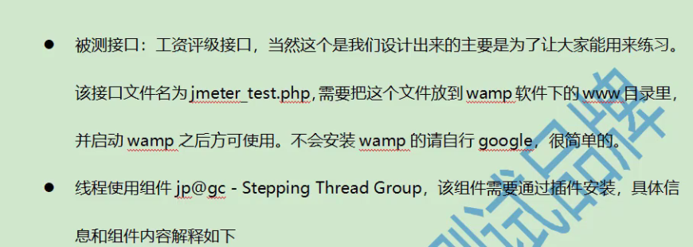
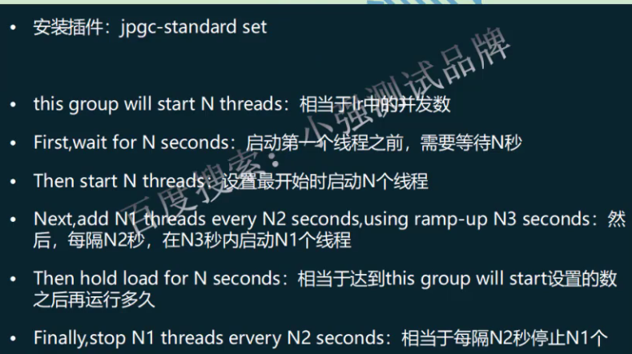
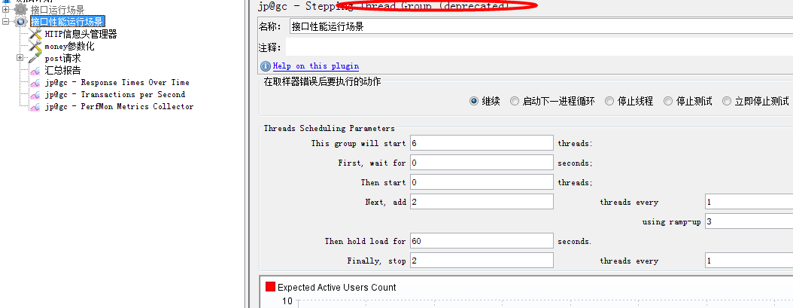
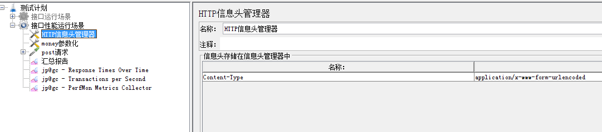
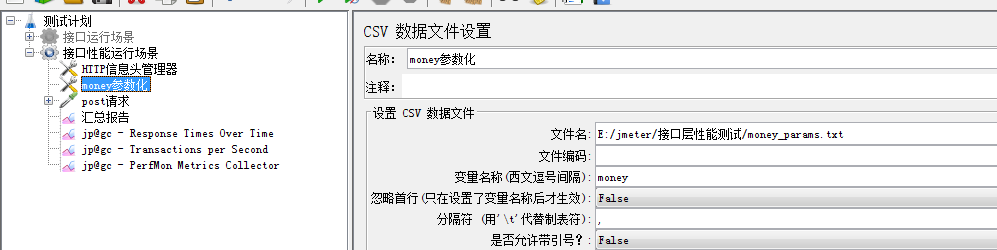
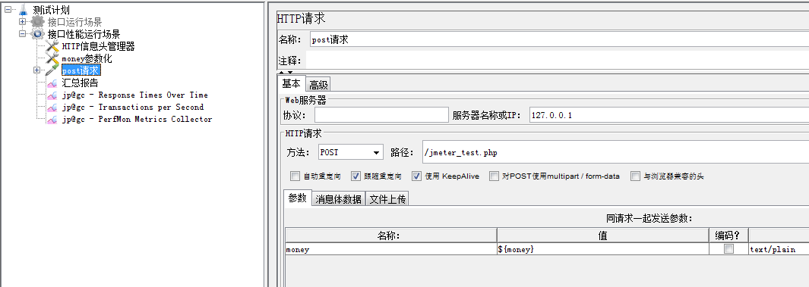
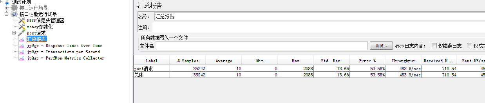

性能测试操作步骤

    * 不使用线程组，使用jp@gc - Stepping Thread Group (deprecated)
    * 设置线程的参数
    * 根据接口文档：建立http请求，post,参数化，断言error_code,信息头
    * 填入HTTP信息头管理器
    * 参数化
    * 添加监听器：汇总报告，响应时间图，tps图，服务器资源监控图
    
注意：tps指标： tps越高系统处理的系统越快，性能越好，比如过闸口，每秒通过的人越多，性能越好
      IO： 跟磁盘IO交互对性能影响较大，尽量使用内存
    
    * 禁用查看结果树
    * 启动serveragent,添加指标
    

