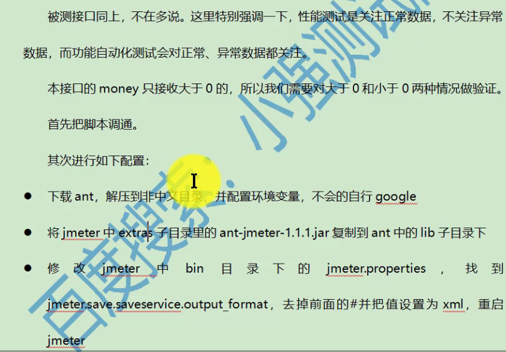
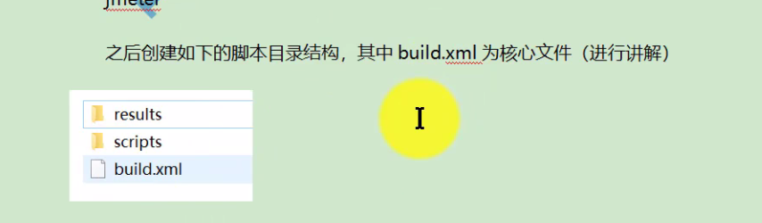
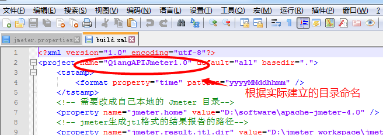
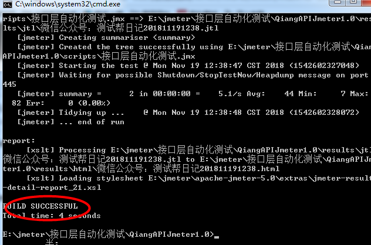
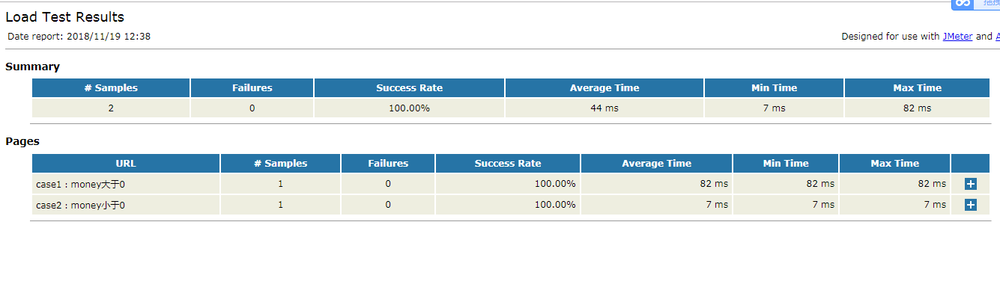
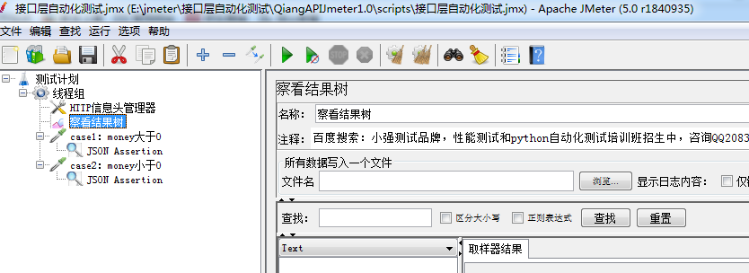

性能测试只考虑正常流程，自动化测试需要考虑正常和异常流程

    * 在results目录中再建立html和jtl目录
    
    * 打开builud.xml文件修改配置
    ------<project name="QiangAPIJmeter1.0" default="all" basedir=".">
          QiangAPIJmeter1.0为包含html和jtl目录 的目录名
    

    -----修改本地目录
    <!-- 需要改成自己本地的 Jmeter 目录-->
    <property name="jmeter.home" value="D:\software\apache-jmeter-4.0" />
    
    -----修改生成报告的路径
    <!-- jmeter生成jtl格式的结果报告的路径-->
    <property name="jmeter.result.jtl.dir" value="D:\jmeter_workspace\jmeter视频脚本\接口层自动化测试\QiangAPIJmeter1.0\results\jtl" />
    <!-- jmeter生成html格式的结果报告的路径-->
    
    -----生成报告的前缀
      <!-- 生成的报告的前缀 -->
    <property name="ReportName" value="微信公众号：测试帮日记" />
    
    -----修改script路径和完整脚本名(如果要执行多个文件就将接口自动化改为"*")
    <!-- 声明要运行的脚本。"*.jmx"指包含此目录下的所有jmeter脚本 -->
            <testplans dir="D:\jmeter_workspace\jmeter视频脚本\接口层自动化测试\QiangAPIJmeter1.0\scripts" includes="接口层自动化测试.jmx" />
            
    ----自带的模板
     <xslt in="${jmeter.result.jtlName}" out="${jmeter.result.htmlName}" style="${jmeter.home}/extras/jmeter-results-detail-report_21.xsl" >    
     在extras目录中可以找到
     
 最后：
    
    * 在cmd命令窗口切换到build.xml所在目录
    * 输入ant
    

