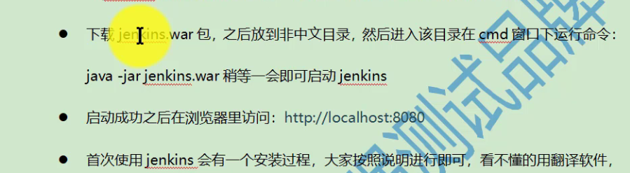
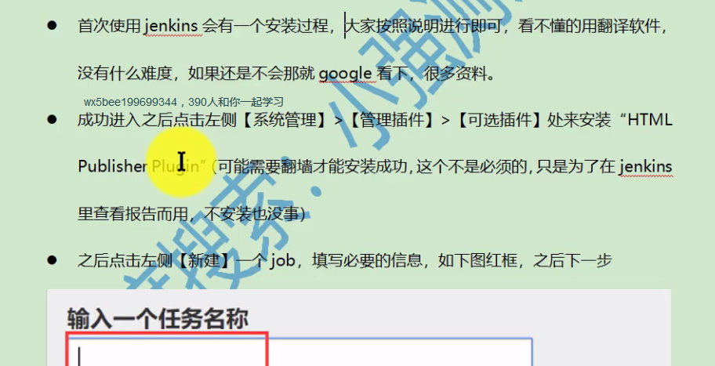
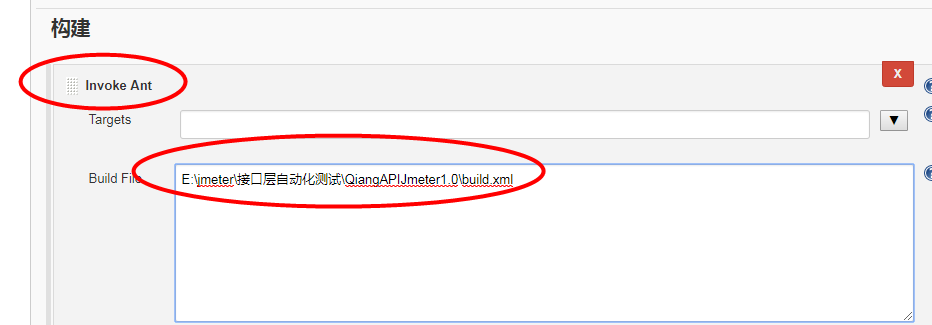
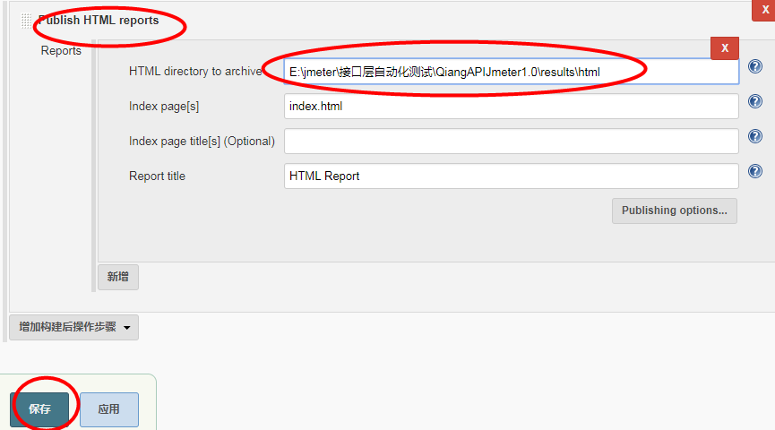
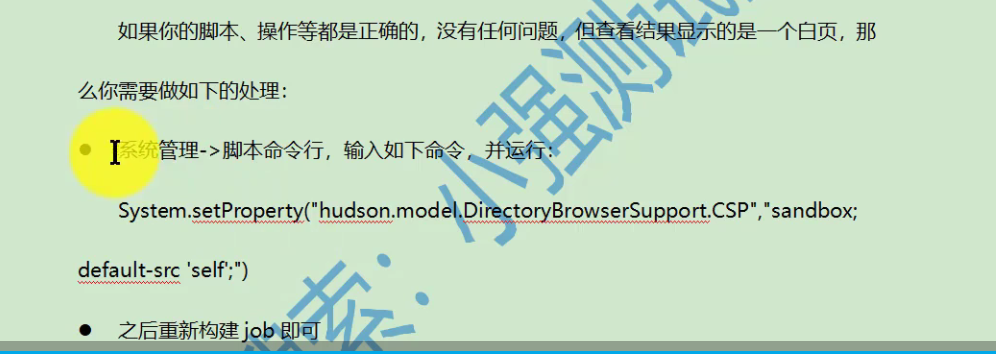

接口自动化与jenkins集成

    jenkins其实就是一个控制任务执行的工具，有点类似定时任务

    步骤如下：
    

    
    * 启动之后就可以在浏览器访问：http://localhost:8080
    

    * 新建任务----构建---invoke Ant---高级---build file---加入build.xml的存放路径
    
    * 构键后的操作----publish html report
      HTML directory to active填入报告路径
      保存
    

   

    * 回到列表页就可以运行了 
    
 