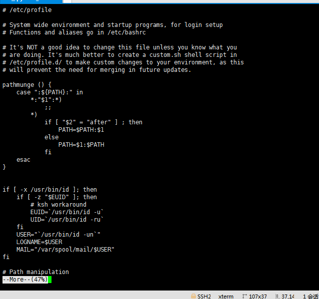
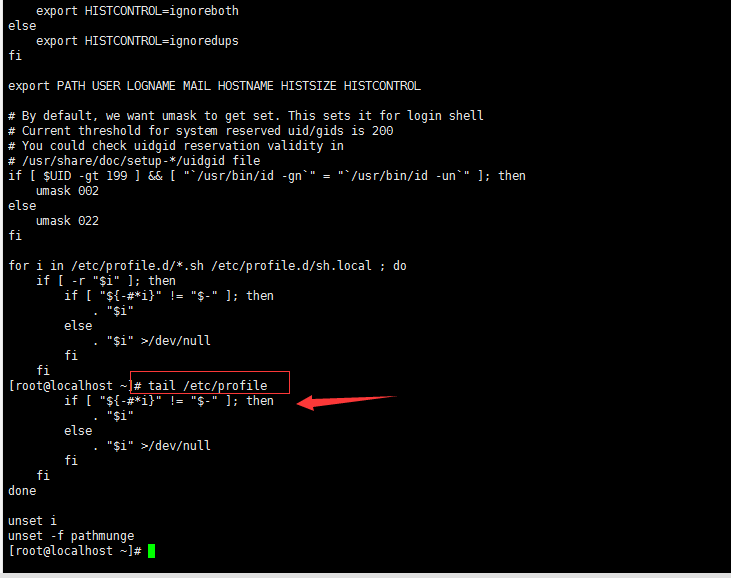
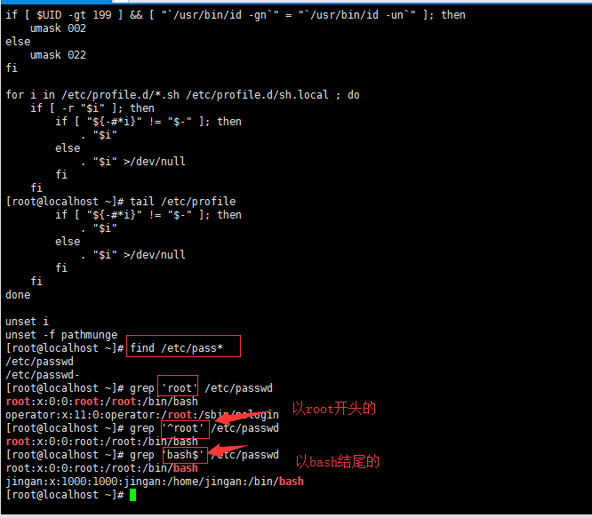
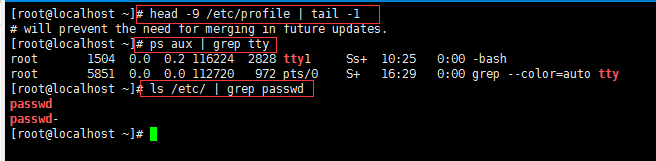
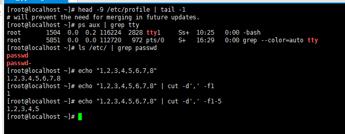
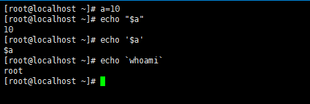

linux简单命令
    
    1、关闭linux系统命令: init0
    2、切换虚拟终端: Ctrl+Alt+F[1~6]
    3、普通用户登录后系统提示符： $
    4、root用户登录后系统提示符：#
    5、退出命令： exit
    
linux命令的格式

    命令 [选项] [参数]
        *命令： 告诉linux操作系统执行什么
        *选项： 说明命令运行的方式，选项部分以"-"字符开始的
        *参数： 说明命令操作的是什么（一个文件，一个目录或是一段正文文字）
        
        ls -l /boot
        
    一、查看当前是什么用户登录(root用户或普通用户)命令： whoami
    二、查看哪些用户在系统中工作命令； who
    三、查看并修改日期的命令(只是实现在当前系统)： date '09052018' 回车再次输入date命令就修改成功了，日期格式：月日时分年
    四、查看日历的命令： cal(查看指定日历cal 7 1999)
    五、清屏的快捷键： Ctrl+l或clear命令
    六、同步时间命令： hwclock -s(同步硬件时间) hwclock -w(同步系统时间)
    七、新建用户的命令： useradd
        useradd liaojingan
        passwd 
        默认用户密码为root
        
        终止上述行为的命令：Ctrl+c
    八、passwd命令的功能：修改用户的密码(既可以是普通用户、也可以是root用户)、查看用户的密码状态
    九、su命令功能：从当前用户切换到另一个指定的用户(切换到root用户 su -root)
    十、获取某个linux命令的使用说明命令； 方法一：man (man useradd)  按字母“q”退出   方法二： useradd --help
    
目录管理

    ls、cd、pwd、mkdir、rmdir、tree
    
文件管理

    touch、stat、file、rm、cp、mv、nano、vi、vim
    
日期时间

    date、clock、hwclock、cal、ntpdate
    
查看文本

    cat、more、tail、less、head、find、grep、tac
    
    cat列出了所有的内容，日志文件太大，会抢占系统资源，极端系统下可能崩溃，所以cat使用在小文件
    tac命令与cat的不同之处在于，cat按正序读取文件，tac按倒序读取文件
    
    稍大的文件应使用more或者less
    上图按"空格"可以切换到下一个版面，按键"q"进行退出,less与more的不同之处在于more是按屏切换，而less是按行切换
    

        
    tail命令查看日志后n行(数据无时无刻都在更新，就可使用)
    

    
    查看实时日志----例如： tail -f /etc/profile
                        tail -10 /etc/profile 查看倒数10行的日志
        
    head命令查看日志前n行
    head -100 /etc/profile   查看日志的前100行
    
查看文件命令find

    find pass* 在当前目录下查找以pass开头的文件
    find /etc/pass* 在etc目录中查找以pass开头的文件
    find /etc/pass* -print 在etc目录中查找以pass开头的文件并显示出来
    
在文件内容中查找关键字 grep

    grep "rpm" /etc/passwd 在/etc/passwd文件中查找关键字rpm
    

    
    
管道: |

    例如：只读取/etc/profile中的第九行内容
    head -9 /etc/profile | tail -1   表示将管道左边命令的执行结果作为参数传给右边的命令进行操作(tail -1 表示倒数第一行)
    ls -l | more  按屏切换查看
    ps aux | grep tty   单独查找一个tty的进程

文本处理

    cut、sort、join、sed、      awk
    
    文本文件：
    Tom:23:male:2013/05/06
    cut:
        -d: 指定字段分隔符，默认是空格
        -f: 指定要显示的字段
            -f 1,3
            -f 1-3
            

    文本排序：sort(主要用来进行排序)
        -n: 数值排序
        -r: 降序
        -t: 字段分隔符
        -k: 以哪个字段为关键字进行排序
        -u: 排序后相同的行只显示一次
        -f: 排序时忽略字符大小写
        
     补充echo是打印
        
linux引号
    
    单引号：'' 字符串
    双引号："" 变量替换
    反引号：`` 命令替换
        

        

    
