（1） linux网络设置

    1、网络检查： 
    
    检查vmware服务是否启动成功
    
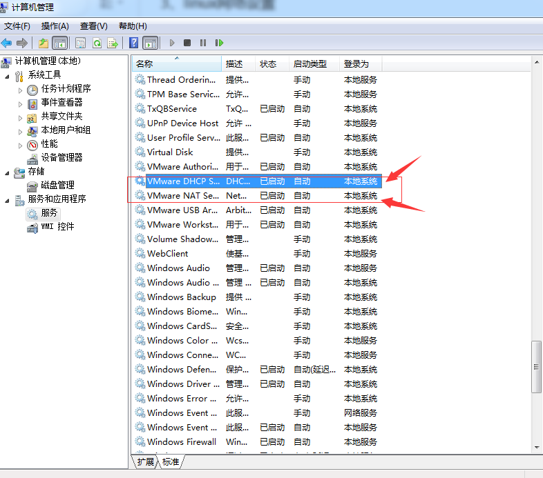

    检查vmvare网络编辑器的NAT模式的默认网关和子网掩码

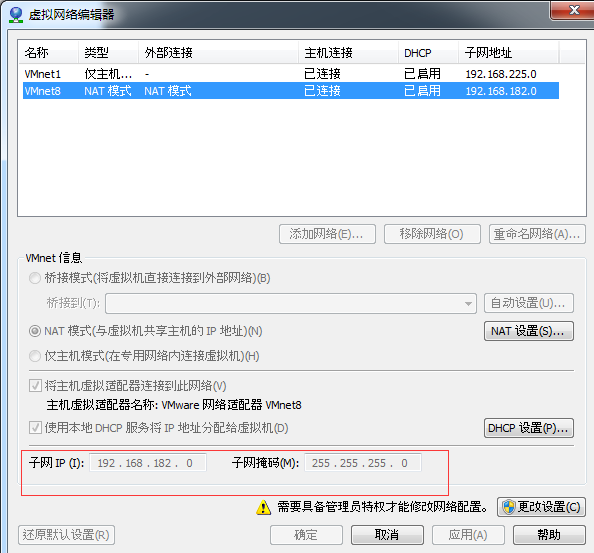    

    检查linux操作系统的网络设置是否为NAT模式
    
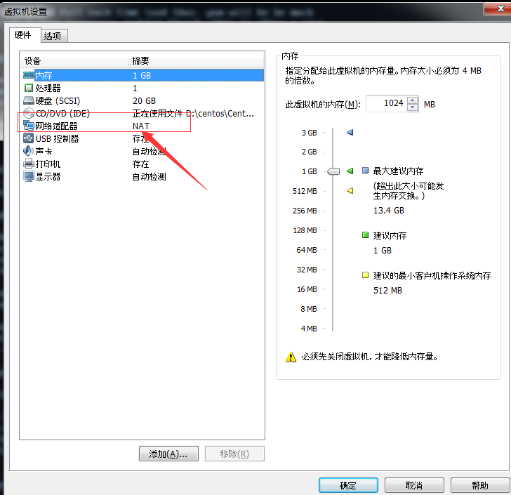 

    

（2） 设置网络

    修改网络地址
        a 设置网卡为nat模式
        b 确保windows下的服务是否启动(dhcp、net服务)
        c 编辑文件 先输入命令： vim /etc/sysconfig/network-scripts/ifcfg-
        
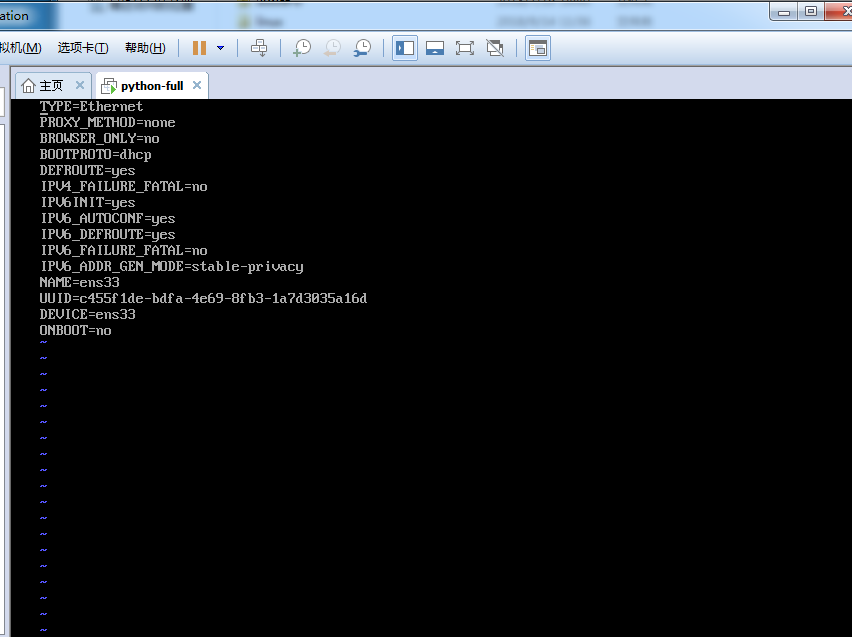

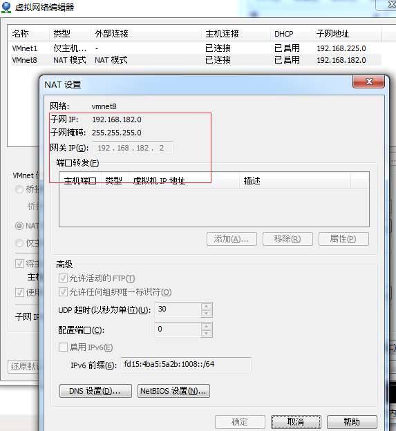

        d 根据上述图片修改内容并保存   ONBOOT=yes
        
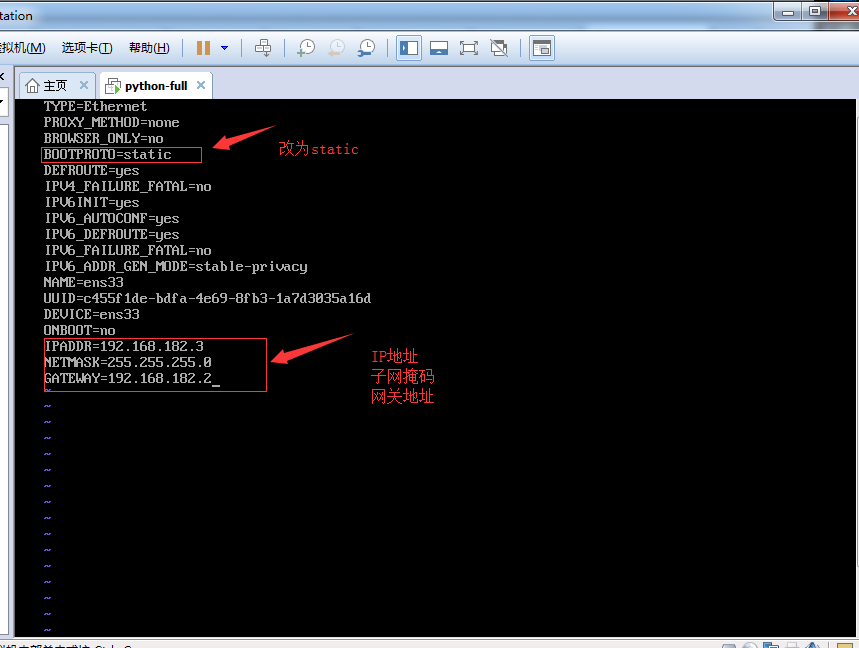

        e 点击Esc键，然后输入 ":wq"保存
        f service network restart  重启
        
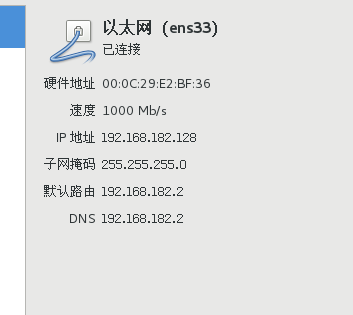

    补充进入vim时，先点击字母"i"进入编辑模式，最后点击"Esc"按键并输入":wq"进行保存设置(输入":q"不保存，只退出")

    1、安装完整版的镜像文件
    
    切换为终端界面： systemctl set-default multi-user.target (或者init5)  
    切换图形界面： systemctl set-default graphical.target (或者init3)

    2、安装xshell
    
    *首先查看centos7里的ip
    https://blog.csdn.net/dancheren/article/details/73611878

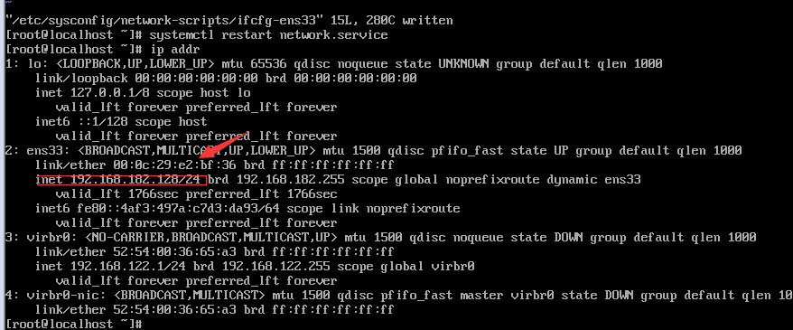  

    *在xshell中新建一个会话

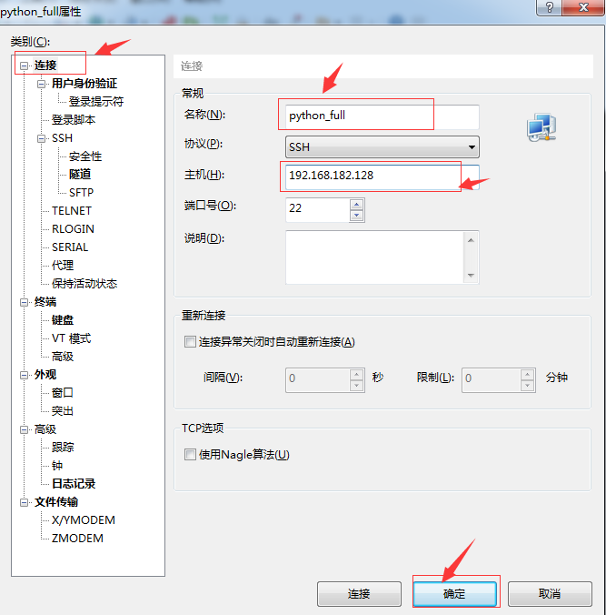 

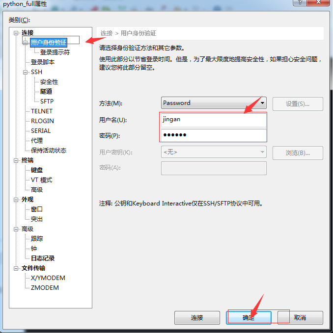   

    3、安装Xftp进行文件的上传下载
        新建会话窗口，要上传下载，只需要进行相互拖拽即可
        补充：忘记密码可以修改用户名和密码
        init 0命令可以关机(实际关机命令为：shutdown now)
        init 6命令可以进行重启(实际重启命令为： reboot)
    
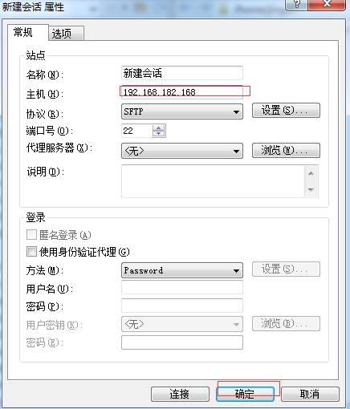 

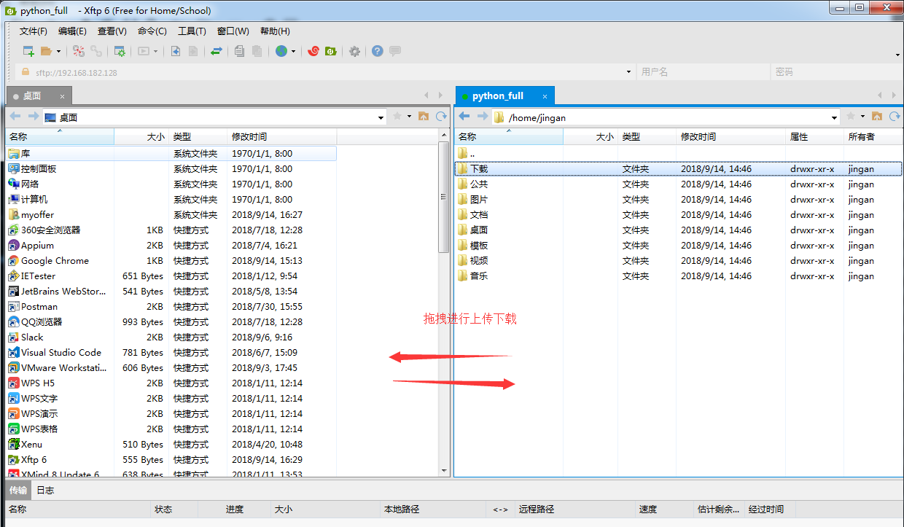 

5、添加硬盘

    
    