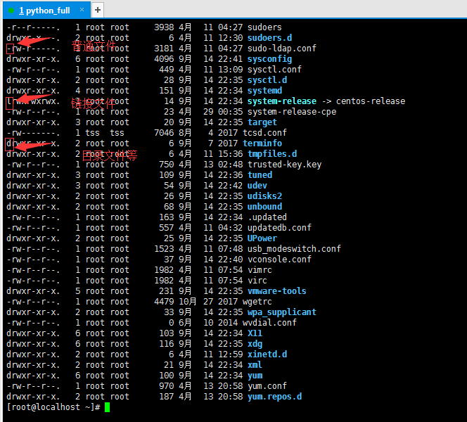
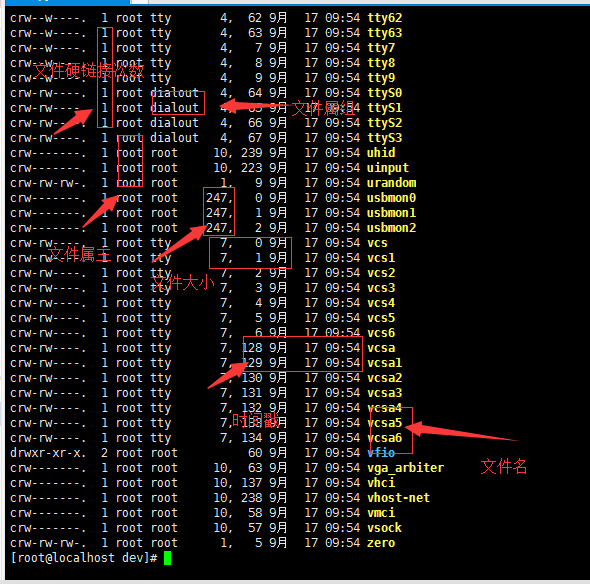
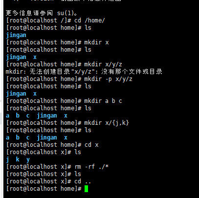

linux基本原则

    *一切皆文件
    *配置文件保存为纯文本格式
    
用户接口分为两大类：所有接口都为应用程序

    GUI接口(图形桌面接口)
    CLI接口(命令行接口)
        命令提示符：后面可以输入命令的地方
        
    命令的格式：
        命令 选项 参数     (如果参数本身存在空格，则用引号包围即可，选项是以"/"开头的)
            选项：
                短选项：(一个杠‘-'表示短选项) ls -l /etc/
                ls -la /etc/ 相当于命令    ls -l -a /etc/
                    多个选项可以组合：
                长选项：(两个杠'--'表示长选项)
            参数：命令的作用对象 
            
了解具体命令

    ls 
      -l:  长格式(显示文件的详细列表)
        文件类型：
            -: 普通文件(f)
            d: 目录文件
            b: 块(字节)设备文件(block)----光驱、硬盘
            c: 字符(键盘、显示器)设备文件(character)
            l: 符号链接文件(symbolic link file) —— 相当于windows中桌面的快捷方式就是链接文件
            p: 命令管道文件(pipe)
            s: 套接字文件(socket)
          

    文件权限：总共9位，每3位一组，3组权限(U、G、O)每一组： rwx(读、写、执行),r--,第一组：文件的属主用户权限；第二组：文件的属组用户权限；第三组：其它用户权限。
        文件硬链接的次数
        文件的属主(owner)即文件的拥有者
        文件的属组(group)即所在用户组群的名字
        文件的大小(size)单位是字节
        时间戳(timestamp):最近一次被修改的时间
            访问：access
            修改：modify,文件内容发生了改变
            改变：change,metadata,元数据

    
        
    -h: 做单位转换
    -a: 显示以"."开头的隐藏文件
        .  表示当前目录
        .. 表示父目录
        
    -A
    -d: 显示目录自身的属性
    -i: index node, inde
    -r: 逆序显示
    -R: 递归(recursive)显示
    
    
    cd: change directory
        家目录，主目录，home directory  
        cd ~USERNAME: 进入指定用户家目录
        cd -: 在当前目录和前一次所在的目录来回切换
        
命令类型分为：(区分内置命令和外部命令，只需在命令前添加type)

    内置命令(shell内置), 内部，内建
    外部命令：在文件系统的某个目录下有一个与命令名称相应的可执行文件 
    例如：输入 type cd    或   type echo
    结果返回：cd is a shell builtin  就是内置命令
    
    help cd 命令： 查看内置命令的使用方法
    date --help 或  man date  命令： 查看外部命令的使用方法 
    printenv 命令： 查看环境变量   
    
    翻屏：
        向后翻一屏：SPACE
        向前翻一屏： b
        向后翻一行：J/ENTER
        向前翻一行： k
        
    查找：
        :/KEYWORD 向后
        n: 下一个
        N: 前一个
        q: 退出
        
    硬件时间一直在进行，系统时间可以关闭
    同步时间命令： hwclock -s(同步硬件时间) hwclock -w(同步系统时间)
        
简单练习

    a: 使用date单独获取系统当前的年份、月份、日、小时、分钟、秒  (例如：date +%B)
    b: echo是内部命令还是外部命令？  type echo
       其作用？
       如何显示echo "The year is 2018" "Today is 29"为两行？
       
文件系统：
    
    rootfs: 根文件系统 "/"(只有一个根，不像Windows可以分为C、D、E盘多个根目录)
    FHS:   Linux
    
    /boot: 系统启动相关的文件，如内核、initrd、以及grub
    /dev: 设备文件
          设备文件：
            块设备:随机访问、数据块
            字符设备：线性访问，按字符为单位
            设备号： 主设备号(major)和次设备号(minor)
    /etc: 配置文件
          (网卡配置vim /etc/sysconfig/network-scripts/ifcfg-eth0，操作系统环境变量配置vim /etc/profile)
          
    /home: 用户的家目录，每一个用户的家目录通常默认为/home/USERNAME
    /root: 管理员的家目录
    /lib: 库文件
          静态库, .a
          动态库, dll, so(shared object)
          /lib/modules: 内核模块文件
    /lib64
    /media: 挂载点目录，移动设备
    /mnt: 挂载点目录，额外的临时文件系统(读取任何设备信息的时候都需要挂载，比如读取U盘的信息)
        比如将cdrom挂载在media中的命令： 
        [root@localhost /]# cd /dev/
        [root@localhost dev]# mount /dev/cdrom /media/
        mount: /dev/sr0 写保护，将以只读方式挂载
        [root@localhost dev]# cd /media/
        [root@localhost media]# ls
        CentOS_BuildTag  EULA  images    LiveOS    repodata              RPM-GPG-KEY-CentOS-Testing-7
        EFI              GPL   isolinux  Packages  RPM-GPG-KEY-CentOS-7  TRANS.TBL

    /opt: 可选目录，第三方程序的安装目录
    /proc: 伪文件系统，内核映射文件(跟内存中的目录一一对应的关系,删除了并不影响系统，重启后会再次生成，关机后文件就为空)
    /sys: 伪文件系统，跟硬件设备相关的属性映射文件
    /tmp: 临时文件， /var/tmp (若是磁盘满了，关机后会首先清除此文件中的内容)
    /var: 可变化的文件
    /usr: 安装第三方软件包
    /bin: 可执行文件，用户命令(whereis cp 查看cp命令的可执行文件)
    /sbin: 管理命令
    
路径

    绝对路径：以根目录为起点到达目标的路径  /etc/sysconfig/network-scripts/ifcfg-eth0
    相对路径：以当前目录为起点到达目标的路径 ls ../etc/sysconfig/network-scripts/ifcfg-eth0
    
创建目录：mkdir

文件的创建：touch 

    touch 1.txt  

    文件的三种时间：
        最后一次访问时间
        最后一次修改时间(仅仅是内容的修改)
        最后一次改变时间(文件【内容和元数据】的改动叫改变）
        
    一个文件有两种数据： 元数据、内容数据
        内容数据： 文件内容本身
        元数据： 除了内容数据之外的（文件的权限、文件的大小、文件的时间、属主) 
        
删除文件：rm

    -i：删除文件之前确认
    -f：删除之前不确认
    -r：递归删除(只要目录下有目录都会删除)
    
    rm -rf /   相当于linux自杀
    
    [root@localhost x]# rm -i 1.txt
    rm：是否删除普通空文件 "1.txt"？y

    
复制：cp

    cp SRC DEST
        -r
        -i 存在覆盖前确认
        -f
        -p
        -a 归档复制，常用于备份
        
    [root@localhost x]# cp /root/install.log ./my.log
    如果只是一个点表示当前目录
    
    从一部虚拟机中拷贝文件或目录x(拷贝目录需要加"-r",就是拷贝目录下的目录)到另一台虚拟机中home目录中  
    [root@localhost ~]# scp -r x/ root@192.168.239.139:/home
    
    从另一部虚拟机拷贝x目录下的1.txt文件到这台虚拟机的方式
    [root@localhost ~]# scp root@192.168.239.139:/home/x/1.txt .
    
重命名(剪切)文件：mv

    mv: SRC DEST
    mv -t DEST SRC
    
    补充：记不住命令可以先输入命令的一部分，再按tab键
    
    
练习：

    1、创建test目录，在里面创建aa,bb,cc三个目录，在aa里创建hello文件，；在bb里创建world文件，在cc里创建itcast.py,然后执行ls -R最后删除test
    2、查看当前的linux系统时间和修改系统时间
    3、修改系统的时区
    4、把命令cat执行看到的结果存放到cat.txt中
    5、创建一个文件test.txt,修改其权限为所有者可读可写，其他人没有任何权限
    6、创建一个叫xiaohua用户，然后创建一个新的用户组meinv,并将xiaohua用户添加到这个用户组中，然后创建一个新的文件，名字叫123.py,并修改它的用户组为meinv
   
常用命令大全：https://www.cnblogs.com/fnlingnzb-learner/p/5831284.html 
