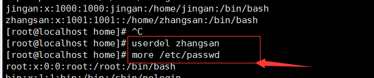

用户权限管理

    用户管理： useradd、 userdel、 usermod、 passwd、 chsh、 chfn、 finger、 id、 chage
    
    组管理： groupadd、 groupdel、 groupmod、 gpasswd
    
    权限管理: chown、 chgrp、 chmod、 umask
    
1.用户管理(增删改查)

创建用户(root用户id为0)
    
    useradd [options] USERNAME
        -u UID(用户)
        -g GID(基本组)
        -r 添加系统用户
        -G GID... (附加组)
        -d /path/to/directory 指定家目录(代表普通用户在当前目录拥有最高权限,一般在操作系统的home目录下)
        -s SHELL (用户接口)指定登录后的shell
        
    创建一个张三用户： [root@localhost ~]# useradd zhangsan
        
    passwd 记录了所有用户的行为       [root@localhost home]# more /etc/passwd
    
    最后一行中的第一个1001表示张三用户的id ， 第二个1001表示所在组的组id
    zhangsan:x:1001:1001::/home/zhangsan:/bin/bash
    
    指定组id的创建用户的方式： [root@localhost ~]# useradd -g 501 lisi
    
删除用户

    userdel  
    不添加 -r 只能删除/etc/passwd/下的用户，但是使用ls命令查看还是能看到用户主目录
    如果已经删除了用户，还存在用户主目录可以使用 rm -rf /home/username 进行删除

  

设置密码

    passwd [USERNAME]
        --stdin
        -d  删除用户密码
        -u

    passwd 直接输入:passwd为修改root用户的密码
    
           如果指定用户修改密码则在passwd后添加用户名，例如： passwd jingan 
         
 

    直接自定义密码，不用输入两次密码进行确认的方式：  [root@localhost home]# echo "123123" | passwd --stdin zs

查看用户账号信息

    finger USERNAME
    
修改用户账号属性

    usermod
        -u UID
        -g GID
        -L 锁定账号
        -U 解锁账号
        
    chsh 修改用户默认的shell(一般用来使用户登录失效)
    
    chfn 修改注释信息      
    
    查看id号方式
    [root@localhost home]# id jingan
    uid=1000(jingan) gid=1000(jingan) 组=1000(jingan),10(wheel)
    
修改用户的密码信息

    chage 
        -d 最近一次的修改时间
        -E 过期时间
        -I 非活动时间
        -m 最短使用期限
        -M 最长使用期限
        -W 警告时间
    一个密码默认可以使用99999天
    
 

2、组管理(u:属主，g:属组，o:其它用户)

 

    drwxr-xr-x.  3 root   root     66 9月  17 17:03 x
    
    第一组权限表示：拥有者权限(root)"rwx" 表示有读、写、执行的权限
    第二组权限表示：这个拥有者用户所在组的其它用户的权限r-x 表示有读、执行的权限(比如张三、李四在一组，张三是拥有者,所以权限是李四的)
    第三组权限表示：其它用户的权限 r-x 表示有读、执行的权限(就是除张三、李四外的其它用户的权限)
    
    比如"jingan"这个用户属于其它用户要查看对"x"有没有删除权限就看第三组，因为没有w权限，所以无法删除
    如果要赋予"jingan"删除权限就在root用户下输入： chmod o+w jingan(若是拥有者还是root，无法进行删除则要赋予更高的权限,将拥有者改为jingan)
    
 

    修改组的权限： chmod g+w 
    增加写的权限： chmod 666 1.txt
    
    用二进制表示权限 
    
    对整个x目录中的文件添加写权限(因为x目录在home中)[root@localhost x]# chomd -R o+w x/
    
